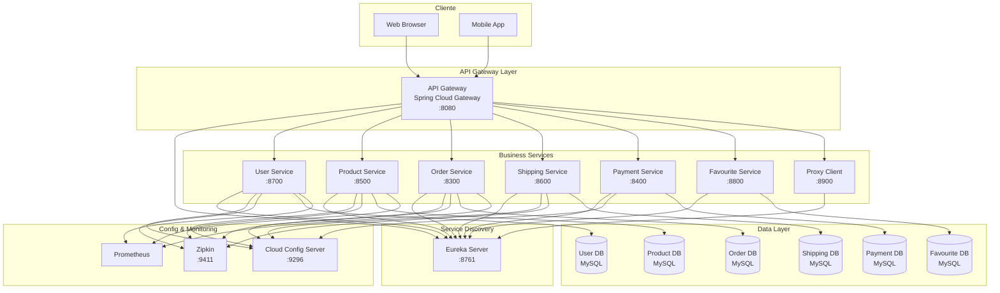
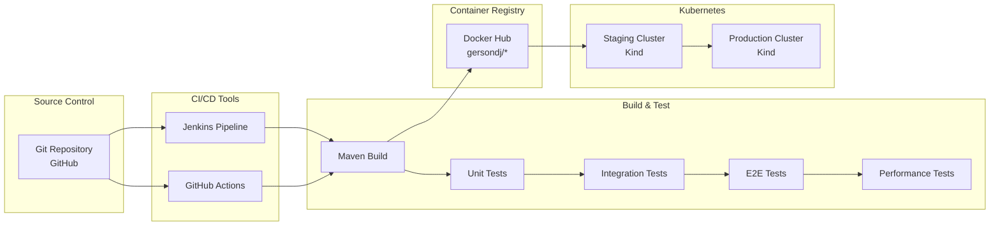
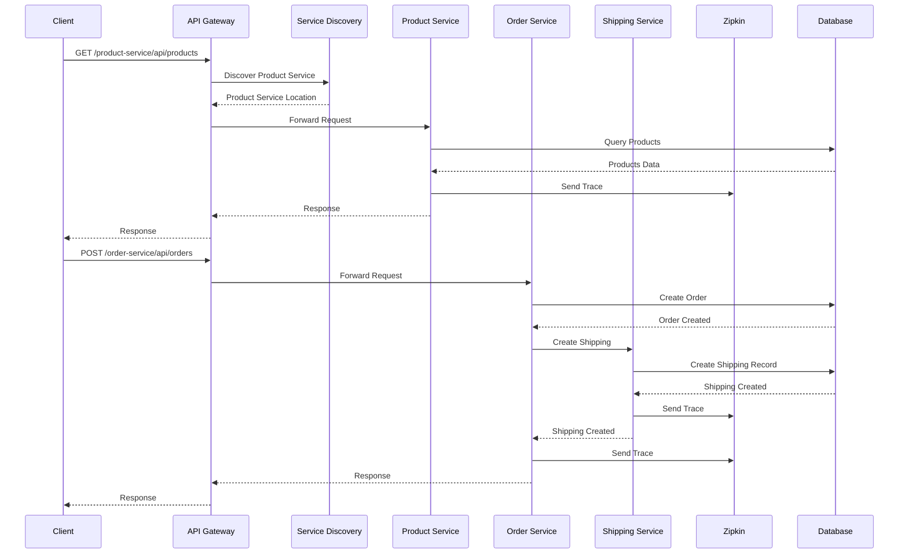
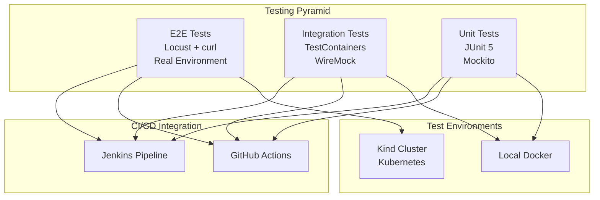
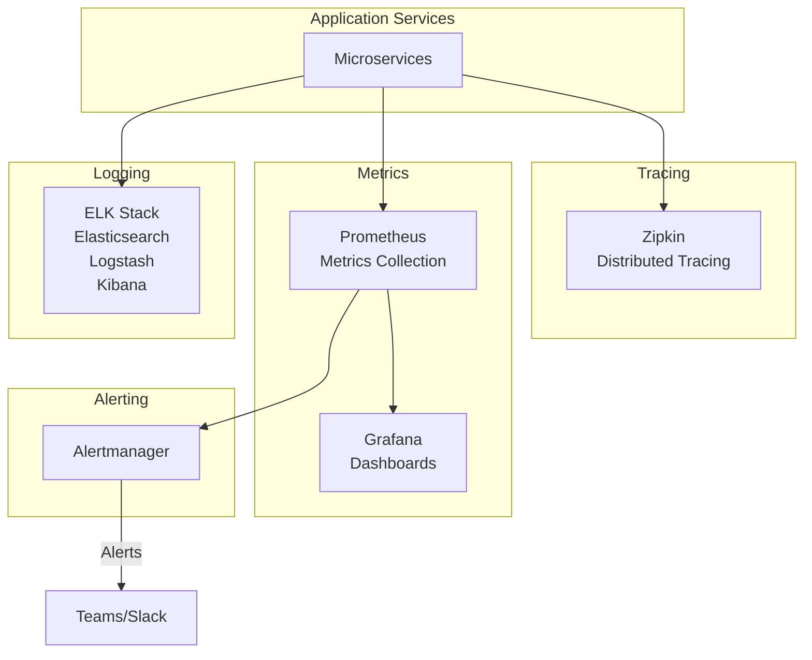

# 📋 Documentación Técnica del Proyecto E-Commerce Microservices

## 📑 Tabla de Contenidos

1. [Introducción](#introducción)
2. [Arquitectura del Sistema](#arquitectura-del-sistema)
3. [Microservicios Implementados](#microservicios-implementados)
4. [Stack Tecnológico](#stack-tecnológico)
5. [Estrategia CI/CD](#estrategia-cicd)
6. [Estrategia de Testing](#estrategia-de-testing)
7. [Análisis de Métricas de Rendimiento](#análisis-de-métricas-de-rendimiento)
8. [Oportunidades de Mejora](#oportunidades-de-mejora)
9. [Diagramas de Arquitectura](#diagramas-de-arquitectura)

---

## 🎯 Introducción

### Descripción del Proyecto

Este proyecto es una **plataforma de e-commerce backend** construida bajo una arquitectura de **microservicios** utilizando **Spring Boot** y **Spring Cloud**. El sistema está diseñado para ser escalable, resiliente y mantenible, siguiendo las mejores prácticas de desarrollo de software empresarial.

### Objetivos del Proyecto

- **Escalabilidad Horizontal**: Cada microservicio puede escalarse independientemente según la demanda
- **Alta Disponibilidad**: Sistema resiliente con circuit breakers y health checks
- **Despliegue Continuo**: Automatización completa de CI/CD con Jenkins y GitHub Actions
- **Observabilidad**: Monitoreo, tracing distribuido y métricas de rendimiento
- **Desacoplamiento**: Servicios independientes que se comunican mediante APIs REST

### Estado del Proyecto

✅ **Implementado y Funcional**
- 11 microservicios core operativos
- Pipeline CI/CD completo (Jenkins + GitHub Actions)
- Tests unitarios, E2E y de rendimiento
- Despliegue automatizado en Kubernetes (Kind)
- Monitoreo con Zipkin y Prometheus

---

## 🏗️ Arquitectura del Sistema

### Patrón Arquitectónico

El proyecto implementa una **arquitectura de microservicios** con los siguientes componentes principales:

1. **Service Discovery (Eureka)**: Registro y descubrimiento de servicios
2. **API Gateway (Spring Cloud Gateway)**: Punto de entrada único para todas las peticiones
3. **Cloud Config Server**: Centralización de configuración
4. **Distributed Tracing (Zipkin)**: Trazabilidad de requests a través de servicios
5. **Circuit Breaker (Resilience4j)**: Resiliencia ante fallos

### Flujo de Comunicación

```
Cliente → API Gateway → Service Discovery → Microservicios → Bases de Datos
                ↓
            Zipkin (Tracing)
                ↓
         Prometheus (Métricas)
```

### Principios de Diseño Aplicados

- **Single Responsibility**: Cada servicio tiene una responsabilidad específica
- **API-First**: Comunicación mediante APIs REST bien definidas
- **Stateless**: Los servicios no mantienen estado de sesión
- **Database per Service**: Cada servicio tiene su propia base de datos
- **Event-Driven**: Comunicación asíncrona cuando es necesario

---

## 🔧 Microservicios Implementados

### 1. **Service Discovery** (Puerto 8761)
- **Tecnología**: Spring Cloud Eureka Server
- **Función**: Registro centralizado de todos los microservicios
- **Características**:
  - Auto-registro de servicios
  - Health checks automáticos
  - Dashboard de visualización
- **Razón de Implementación**: Permite que los servicios se descubran dinámicamente sin configuración hardcodeada

### 2. **Cloud Config Server** (Puerto 9296)
- **Tecnología**: Spring Cloud Config Server
- **Función**: Gestión centralizada de configuración
- **Características**:
  - Configuración por ambiente (dev, staging, prod)
  - Actualización dinámica sin reiniciar servicios
- **Razón de Implementación**: Centraliza la configuración, facilitando el mantenimiento y la gestión de múltiples ambientes

### 3. **API Gateway** (Puerto 8080)
- **Tecnología**: Spring Cloud Gateway
- **Función**: Punto de entrada único para todas las peticiones
- **Características**:
  - Enrutamiento dinámico basado en rutas
  - Load balancing automático
  - CORS configurado
  - Circuit breaker integration
- **Razón de Implementación**: Simplifica el acceso del cliente, centraliza la seguridad y facilita el monitoreo

### 4. **User Service** (Puerto 8700)
- **Función**: Gestión de usuarios y autenticación
- **Endpoints principales**:
  - `POST /user-service/api/users` - Crear usuario
  - `GET /user-service/api/users/{id}` - Obtener usuario
  - `PUT /user-service/api/users/{id}` - Actualizar usuario
- **Razón de Implementación**: Separa la lógica de usuarios del resto del sistema, permitiendo escalabilidad independiente

### 5. **Product Service** (Puerto 8500)
- **Función**: Catálogo de productos
- **Endpoints principales**:
  - `GET /product-service/api/products` - Listar productos
  - `POST /product-service/api/products` - Crear producto
  - `GET /product-service/api/products/{id}` - Obtener producto
- **Razón de Implementación**: Servicio más consultado, requiere alta disponibilidad y escalabilidad

### 6. **Order Service** (Puerto 8300)
- **Función**: Gestión de órdenes
- **Endpoints principales**:
  - `POST /order-service/api/orders` - Crear orden
  - `GET /order-service/api/orders` - Listar órdenes
  - `GET /order-service/api/orders/{id}` - Obtener orden
- **Razón de Implementación**: Core del negocio, requiere transaccionalidad y consistencia

### 7. **Shipping Service** (Puerto 8600)
- **Función**: Gestión de envíos y tracking
- **Endpoints principales**:
  - `POST /shipping-service/api/shippings` - Crear envío
  - `GET /shipping-service/api/shippings` - Listar envíos
- **Razón de Implementación**: Servicio independiente que puede escalarse según demanda logística

### 8. **Payment Service** (Puerto 8400)
- **Función**: Procesamiento de pagos
- **Endpoints principales**:
  - `POST /payment-service/api/payments` - Procesar pago
  - `GET /payment-service/api/payments/{id}` - Obtener estado de pago
- **Razón de Implementación**: Servicio crítico que requiere seguridad y aislamiento

### 9. **Favourite Service** (Puerto 8800)
- **Función**: Gestión de favoritos del usuario
- **Endpoints principales**:
  - `POST /favourite-service/api/favourites` - Agregar favorito
  - `GET /favourite-service/api/favourites/{userId}` - Listar favoritos
- **Razón de Implementación**: Funcionalidad independiente que puede optimizarse por separado

### 10. **Proxy Client** (Puerto 8900)
- **Función**: Cliente frontend proxy
- **Características**: Interfaz para aplicación frontend
- **Razón de Implementación**: Facilita la comunicación entre el frontend y los microservicios

### 11. **Zipkin** (Puerto 9411)
- **Tecnología**: Distributed Tracing System
- **Función**: Trazabilidad distribuida de requests
- **Razón de Implementación**: Permite diagnosticar problemas de rendimiento y latencia en sistemas distribuidos

---

## 💻 Stack Tecnológico

### Backend
- **Java 11**: Lenguaje de programación
- **Spring Boot 2.5.7**: Framework principal
- **Spring Cloud 2020.0.4**: Microservicios y cloud-native features
- **Spring Data JPA**: Persistencia de datos
- **Resilience4j**: Circuit breaker y resiliencia
- **Spring Cloud Sleuth**: Distributed tracing
- **SpringDoc OpenAPI**: Documentación de APIs

### Infraestructura
- **Docker**: Containerización
- **Kubernetes (Kind)**: Orquestación de contenedores
- **Maven**: Gestión de dependencias y build
- **Eureka**: Service discovery
- **Zipkin**: Distributed tracing
- **Prometheus**: Métricas y monitoreo

### CI/CD
- **Jenkins**: Pipeline de CI/CD principal
- **GitHub Actions**: CI/CD para workflows específicos
- **Docker Hub**: Registro de imágenes
- **Kubectl**: Gestión de Kubernetes

### Testing
- **JUnit 5**: Framework de testing
- **Mockito**: Mocking de dependencias
- **TestContainers**: Testing con contenedores reales
- **WireMock**: Mocking de servicios externos
- **Locust**: Testing de rendimiento

### Bases de Datos
- **MySQL/PostgreSQL**: Bases de datos relacionales por servicio
- **Flyway**: Migraciones de base de datos

---

## 🚀 Estrategia CI/CD

### Pipeline Dual: Jenkins + GitHub Actions

El proyecto implementa una estrategia híbrida de CI/CD para maximizar la flexibilidad y cobertura:

#### **Jenkins Pipeline** (Principal)

**Ubicación**: `Jenkinsfile`

**Características**:
- Pipeline completo de CI/CD
- Detección automática de cambios por servicio
- Build paralelo de servicios modificados
- Despliegue automático a staging/producción
- Tests E2E y de rendimiento

**Etapas del Pipeline**:
1. **Checkout & Detect Changes**: Identifica servicios modificados
2. **Build Core Services**: Construye service-discovery y api-gateway
3. **Build & Test Changed Services**: Compila y ejecuta tests unitarios
4. **Docker Build**: Construye imágenes Docker
5. **Docker Push**: Sube imágenes a Docker Hub
6. **Deploy Core Services**: Despliega servicios core a staging
7. **Deploy to Staging**: Despliega servicios modificados
8. **Integration Tests**: Ejecuta tests de integración
9. **Deploy Services for Testing**: Despliega todos los servicios
10. **E2E Tests**: Pruebas end-to-end
11. **Performance Tests**: Pruebas de rendimiento con Locust
12. **Deploy to Production**: Despliegue a producción (condicional)

**Variables de Entorno**:
- `REGISTRY`: `docker.io/gersondj`
- `K8S_NAMESPACE_STAGING`: `microservices-staging`
- `K8S_NAMESPACE_PROD`: `microservices-prod`

#### **GitHub Actions** (Complementario)

**Ubicación**: `.github/workflows/`

**Workflows Implementados**:

1. **Unit Tests Workflows** (30 archivos)
   - `*-pipeline-*-push.yml`: Ejecuta tests unitarios en push
   - `*-pipeline-*-pr.yml`: Ejecuta tests unitarios en pull requests
   - **Servicios**: api-gateway, cloud-config, user-service, product-service, order-service, shipping-service, payment-service, favourite-service, proxy-client, service-discovery
   - **Branches**: develop, stage, master

2. **E2E Tests Workflow** (`e2e-tests.yml`)
   - Crea cluster Kind temporal
   - Construye y despliega todos los servicios
   - Ejecuta pruebas end-to-end
   - Limpia recursos al finalizar

3. **Performance Tests Workflow** (`performance-tests.yml`)
   - Crea cluster Kind temporal
   - Despliega servicios
   - Ejecuta tests de rendimiento con Locust
   - Genera reportes HTML y CSV

**Ventajas de la Estrategia Dual**:
- ✅ **Jenkins**: Pipeline completo, control granular, integración con infraestructura propia
- ✅ **GitHub Actions**: Tests rápidos, feedback inmediato, integración nativa con GitHub
- ✅ **Redundancia**: Si un sistema falla, el otro puede continuar

---

## 🧪 Estrategia de Testing

### Pirámide de Testing

El proyecto implementa una **pirámide de testing completa** con múltiples niveles:

```
                    ┌─────────────────┐
                    │  E2E Tests      │  ← Pocos, críticos
                    └─────────────────┘
                ┌─────────────────────────┐
                │  Integration Tests     │  ← Algunos, importantes
                └─────────────────────────┘
        ┌───────────────────────────────────────┐
        │      Unit Tests                       │  ← Muchos, rápidos
        └───────────────────────────────────────┘
```

### 1. **Unit Tests** (Tests Unitarios)

**Framework**: JUnit 5 + Mockito + AssertJ

**Cobertura**:
- Tests por servicio en `src/test/java/`
- Validación de lógica de negocio
- Mocking de dependencias externas
- Validación de DTOs y entidades

**Ejecución**:
- **GitHub Actions**: Automático en cada push/PR
- **Jenkins**: Durante la etapa "Build & Test Changed Services"
- **Comando**: `mvn test`

**Configuración**:
```xml
<plugin>
    <groupId>org.apache.maven.plugins</groupId>
    <artifactId>maven-surefire-plugin</artifactId>
    <configuration>
        <includes>
            <include>**/*Test.java</include>
            <include>**/*Tests.java</include>
        </includes>
        <excludes>
            <exclude>**/*IntegrationTest.java</exclude>
        </excludes>
    </configuration>
</plugin>
```

**Ejemplo de Test**:
```java
@Test
@DisplayName("Should create user successfully")
void testCreateUser() {
    // Arrange
    UserDto userDto = new UserDto(...);
    
    // Act
    UserDto result = userService.create(userDto);
    
    // Assert
    assertThat(result).isNotNull();
    assertThat(result.getUserId()).isNotNull();
}
```

**Razón de Implementación**: Validar rápidamente la lógica de negocio antes de integraciones más complejas.

---

### 2. **Integration Tests** (Tests de Integración)

**Framework**: TestContainers + WireMock + Spring Boot Test

**Cobertura**:
- Comunicación entre servicios
- Integración con bases de datos reales
- Validación de APIs REST
- Simulación de servicios externos con WireMock

**Ejemplo**: `OrderPaymentServiceIntegrationTest`
- Prueba la comunicación entre Order Service y Payment Service
- Utiliza WireMock para simular respuestas del Payment Service
- Valida flujos transaccionales completos

**Ejecución**:
- **Jenkins**: Etapa "Integration Tests"
- **GitHub Actions**: Workflow `integration-tests.yml`

**Características**:
- Utiliza TestContainers para bases de datos reales
- Aislamiento mediante transacciones
- Validación de contratos entre servicios

**Razón de Implementación**: Asegurar que los servicios se comunican correctamente y que las integraciones funcionan como se espera.

---

### 3. **E2E Tests** (End-to-End Tests)

**Framework**: curl + bash scripts + validación de respuestas HTTP

**Cobertura**:
- Flujos completos de usuario
- Validación de escenarios de negocio end-to-end
- Pruebas en ambiente staging real

**Escenarios Testeados**:

1. **User Registration and Profile Update Flow**
   ```bash
   # Crear usuario
   POST /user-service/api/users
   # Validar respuesta
   # Actualizar usuario
   PUT /user-service/api/users/{id}
   ```

2. **Product Catalog and Order Creation Flow**
   ```bash
   # Listar productos
   GET /product-service/api/products
   # Crear orden
   POST /order-service/api/orders
   # Agregar items a orden
   POST /shipping-service/api/shippings
   ```

3. **Order Processing Flow**
   ```bash
   # Crear orden
   POST /order-service/api/orders
   # Procesar pago
   POST /payment-service/api/payments
   # Verificar estado
   GET /order-service/api/orders/{id}
   ```

**Ejecución**:
- **Jenkins**: Etapa "E2E Tests" después del despliegue a staging
- **GitHub Actions**: Workflow `e2e-tests.yml` con cluster Kind temporal

**Ambiente**:
- Clúster Kubernetes (Kind) con todos los servicios desplegados
- API Gateway expuesto vía port-forward o NodePort
- Validación de respuestas HTTP y códigos de estado

**Razón de Implementación**: Validar que todo el sistema funciona correctamente en conjunto, simulando el comportamiento real del usuario.

---

### 4. **Performance Tests** (Tests de Rendimiento)

**Framework**: Locust (Python)

**Configuración**:
- **Archivo**: `locustfile.py`
- **Usuarios simulados**: 50
- **Spawn rate**: 10 usuarios/segundo
- **Duración**: 300 segundos (5 minutos)
- **Host**: API Gateway (localhost:30080)

**Comportamiento Simulado**:

La clase `EcommerceUser` simula el comportamiento de un usuario real:

```python
class EcommerceUser(HttpUser):
    wait_time = between(1, 3)  # Espera entre 1-3 segundos
    
    @task(3)  # Peso 3 (27.3% probabilidad)
    def view_products(self):
        """Ver catálogo de productos"""
        
    @task(2)  # Peso 2 (18.2% probabilidad)
    def create_user(self):
        """Crear nuevo usuario"""
        
    @task(2)  # Peso 2 (18.2% probabilidad)
    def get_user(self):
        """Obtener detalles de usuario"""
        
    @task(1)  # Peso 1 (9.1% probabilidad cada uno)
    def create_order(self):
        """Crear orden"""
        
    @task(1)
    def add_order_item(self):
        """Agregar item a orden"""
        
    @task(1)
    def view_orders(self):
        """Ver órdenes"""
        
    @task(1)
    def view_order_items(self):
        """Ver items de orden"""
```

**Distribución de Tareas**:
- **viewProducts**: 27.3% (más frecuente)
- **createUser**: 18.2%
- **getUser**: 18.2%
- **createOrder**: 9.1%
- **addOrderItem**: 9.1%
- **viewOrders**: 9.1%
- **viewOrderItems**: 9.1%

**Ejecución**:
- **Jenkins**: Etapa "Performance Tests"
- **GitHub Actions**: Workflow `performance-tests.yml`
- **Reportes**: HTML y CSV generados automáticamente

**Razón de Implementación**: Identificar cuellos de botella, validar capacidad del sistema y asegurar que el rendimiento es aceptable bajo carga.

---

## 📊 Análisis de Métricas de Rendimiento

### Reporte de Locust - Ejecución del 3/11/2025

**Período**: 3/11/2025, 1:16:11 p.m. - 1:21:11 p.m. (5 minutos)
**Target Host**: http://localhost:30080
**Script**: locustfile.py

---

### 📈 Resumen Ejecutivo

| Métrica | Valor | Interpretación |
|---------|-------|----------------|
| **Total Requests** | 7,202 | ✅ Excelente volumen de pruebas |
| **Failed Requests** | 0 | ✅ **100% de éxito - Sin errores** |
| **Average Response Time** | 26.52 ms | ✅ Excelente (objetivo < 100ms) |
| **RPS (Requests Per Second)** | 24.06 | ✅ Buena tasa de procesamiento |
| **P95 Response Time** | 51 ms | ✅ Muy bueno (objetivo < 200ms) |
| **P99 Response Time** | 330 ms | ⚠️ Aceptable (objetivo < 500ms) |
| **Max Response Time** | 6,189 ms | ⚠️ Requiere atención (picos ocasionales) |

**Veredicto General**: ✅ **Sistema funcionando correctamente bajo carga**

---

### 📋 Estadísticas por Endpoint

#### 1. **GET /product-service/api/products**
- **Requests**: 2,019 (28% del total)
- **Fails**: 0
- **Average**: 28.74 ms
- **Min/Max**: 3 ms / 4,336 ms
- **P95**: 36 ms
- **P99**: 180 ms
- **RPS**: 6.74
- **Tamaño promedio**: 1,055 bytes

**Análisis**:
- ✅ **Endpoint más consultado** - Refleja el comportamiento real (catálogo de productos)
- ✅ **Rendimiento excelente** en el 95% de los casos (36ms)
- ⚠️ **Picos ocasionales** hasta 4.3 segundos - Posible conexión a BD o cache miss
- ✅ **Sin errores** - 100% de disponibilidad

**Recomendación**: Implementar cache (Redis) para reducir latencia y picos.

---

#### 2. **POST /user-service/api/users**
- **Requests**: 1,284 (18% del total)
- **Fails**: 0
- **Average**: 18.71 ms
- **Min/Max**: 4 ms / 3,294 ms
- **P95**: 39 ms
- **P99**: 150 ms
- **RPS**: 4.29
- **Tamaño promedio**: 473 bytes

**Análisis**:
- ✅ **Rendimiento muy bueno** - Operaciones de escritura rápidas
- ✅ **P95 excelente** (39ms) - El 95% de las respuestas son muy rápidas
- ⚠️ **Picos ocasionales** hasta 3.3 segundos - Posible validación de duplicados o escritura en BD
- ✅ **Sin errores** - Sistema robusto

**Recomendación**: Optimizar consultas de validación (índices, cache de validaciones).

---

#### 3. **GET /user-service/api/users/4**
- **Requests**: 1,285 (18% del total)
- **Fails**: 0
- **Average**: 8.81 ms
- **Min/Max**: 3 ms / 469 ms
- **P95**: 20 ms
- **P99**: 59 ms
- **RPS**: 4.29
- **Tamaño promedio**: 510 bytes

**Análisis**:
- ✅ **Rendimiento excepcional** - Lecturas muy rápidas
- ✅ **P95 excelente** (20ms) - Consultas simples optimizadas
- ✅ **Consistencia** - Menor variabilidad que otros endpoints
- ✅ **Sin errores**

**Recomendación**: Mantener este nivel de rendimiento. Considerar cache para usuarios frecuentes.

---

#### 4. **GET /shipping-service/api/shippings**
- **Requests**: 695 (10% del total)
- **Fails**: 0
- **Average**: 97.44 ms ⚠️
- **Min/Max**: 17 ms / 6,189 ms
- **P95**: 340 ms
- **P99**: 1,300 ms
- **RPS**: 2.32
- **Tamaño promedio**: 2,040 bytes

**Análisis**:
- ⚠️ **Endpoint más lento** - Requiere optimización
- ⚠️ **Alta variabilidad** - P95 de 340ms y máximo de 6.2 segundos
- ⚠️ **Posible cuello de botella** - Consultas complejas o joins
- ✅ **Sin errores** - Sistema funcional pero lento

**Recomendación**: 
- **URGENTE**: Revisar queries SQL, agregar índices
- Implementar paginación si no existe
- Considerar cache para consultas frecuentes
- Revisar relaciones con otras tablas (joins)

---

#### 5. **POST /order-service/api/orders**
- **Requests**: 636 (9% del total)
- **Fails**: 0
- **Average**: 11.34 ms
- **Min/Max**: 3 ms / 497 ms
- **P95**: 40 ms
- **P99**: 94 ms
- **RPS**: 2.12
- **Tamaño promedio**: 164 bytes

**Análisis**:
- ✅ **Rendimiento excelente** - Operaciones de escritura rápidas
- ✅ **P95 muy bueno** (40ms) - Transacciones eficientes
- ✅ **Consistencia** - Baja variabilidad
- ✅ **Sin errores**

**Recomendación**: Mantener este nivel. Considerar optimización de transacciones si se aumenta la complejidad.

---

#### 6. **GET /order-service/api/orders**
- **Requests**: 668 (9% del total)
- **Fails**: 0
- **Average**: 25.24 ms
- **Min/Max**: 4 ms / 3,529 ms
- **P95**: 32 ms
- **P99**: 360 ms
- **RPS**: 2.23
- **Tamaño promedio**: 798 bytes

**Análisis**:
- ✅ **Rendimiento bueno** - Lecturas eficientes
- ✅ **P95 excelente** (32ms) - Consultas optimizadas
- ⚠️ **Picos ocasionales** hasta 3.5 segundos - Posible crecimiento de datos
- ✅ **Sin errores**

**Recomendación**: Implementar paginación si no existe. Monitorear crecimiento de datos.

---

#### 7. **POST /shipping-service/api/shippings**
- **Requests**: 615 (9% del total)
- **Fails**: 0
- **Average**: 9.53 ms
- **Min/Max**: 4 ms / 237 ms
- **P95**: 25 ms
- **P99**: 61 ms
- **RPS**: 2.05
- **Tamaño promedio**: 327 bytes

**Análisis**:
- ✅ **Rendimiento excelente** - Operaciones de escritura muy rápidas
- ✅ **P95 muy bueno** (25ms) - Inserciones eficientes
- ✅ **Consistencia** - Baja variabilidad
- ✅ **Sin errores**

**Recomendación**: Mantener este nivel de rendimiento.

---

### 📊 Análisis de Percentiles (Response Time Statistics)

#### Percentiles Agregados (Todos los Endpoints)

| Percentil | Tiempo (ms) | Interpretación |
|-----------|-------------|----------------|
| **50% (Mediana)** | 6 ms | ✅ Excelente - La mitad de las requests son instantáneas |
| **60%** | 7 ms | ✅ Muy bueno |
| **70%** | 8 ms | ✅ Muy bueno |
| **80%** | 12 ms | ✅ Excelente |
| **90%** | 29 ms | ✅ Muy bueno |
| **95%** | 51 ms | ✅ Excelente (objetivo < 200ms) |
| **99%** | 330 ms | ⚠️ Aceptable (objetivo < 500ms) |
| **100% (Máximo)** | 6,189 ms | ⚠️ Requiere atención (picos ocasionales) |

**Interpretación**:
- ✅ **95% de las requests** se completan en menos de 51ms - Excelente
- ✅ **99% de las requests** se completan en menos de 330ms - Aceptable
- ⚠️ **1% de las requests** pueden tardar hasta 6 segundos - Requiere investigación

**Conclusión**: El sistema es **muy rápido en la mayoría de los casos**, pero tiene **picos ocasionales** que deben investigarse.

---

### 🎯 Distribución de Carga

#### Ratio Per Class (Distribución de Tareas)

| Tarea | Porcentaje | Requests Estimados |
|-------|------------|-------------------|
| **viewProducts** | 27.3% | ~1,965 |
| **createUser** | 18.2% | ~1,310 |
| **getUser** | 18.2% | ~1,310 |
| **createOrder** | 9.1% | ~655 |
| **addOrderItem** | 9.1% | ~655 |
| **viewOrders** | 9.1% | ~655 |
| **viewOrderItems** | 9.1% | ~655 |

**Análisis**:
- ✅ **Distribución realista** - Los usuarios consultan productos más frecuentemente
- ✅ **Balance adecuado** - Mezcla de lecturas y escrituras
- ✅ **Escenario realista** - Refleja comportamiento de usuario real

---

### 🎯 Métricas Clave de Rendimiento

#### 1. **Throughput (RPS - Requests Per Second)**
- **Total RPS**: 24.06 requests/segundo
- **Interpretación**: El sistema puede procesar ~24 requests simultáneas por segundo
- **Capacidad**: Con 50 usuarios concurrentes, cada usuario hace ~0.48 requests/segundo (muy realista)

#### 2. **Tasa de Error**
- **Failed Requests**: 0 de 7,202
- **Tasa de Error**: 0%
- **Interpretación**: ✅ **Sistema 100% disponible** durante la prueba

#### 3. **Latencia Promedio**
- **Average**: 26.52 ms
- **Interpretación**: ✅ **Excelente** - Respuestas en menos de 30ms en promedio

#### 4. **Consistencia (P95/P99)**
- **P95**: 51 ms (excelente)
- **P99**: 330 ms (aceptable)
- **Interpretación**: El sistema es **consistente** en el 95% de los casos, con **variabilidad aceptable** en el 99%

---

### 🔍 Análisis de Picos de Latencia

#### Endpoints con Mayor Variabilidad

1. **GET /shipping-service/api/shippings**
   - Máximo: 6,189 ms
   - **Causa probable**: Consultas complejas, joins, falta de índices
   - **Impacto**: Alto (afecta experiencia de usuario)

2. **GET /product-service/api/products**
   - Máximo: 4,336 ms
   - **Causa probable**: Consultas sin cache, paginación ineficiente
   - **Impacto**: Medio (endpoint muy usado)

3. **GET /order-service/api/orders**
   - Máximo: 3,529 ms
   - **Causa probable**: Crecimiento de datos, falta de paginación
   - **Impacto**: Medio

**Recomendaciones**:
1. **Implementar cache** (Redis) para endpoints frecuentes
2. **Optimizar queries SQL** - Agregar índices, revisar joins
3. **Implementar paginación** si no existe
4. **Monitorear crecimiento de datos** - Considerar particionamiento

---

### ✅ Conclusiones del Análisis

#### Fortalezas del Sistema

1. ✅ **100% de disponibilidad** - Sin errores durante la prueba
2. ✅ **Rendimiento excelente** en el 95% de los casos
3. ✅ **Latencia promedio muy baja** (26.52 ms)
4. ✅ **Throughput adecuado** (24 RPS)
5. ✅ **Sistema estable** bajo carga de 50 usuarios concurrentes

#### Áreas de Mejora

1. ⚠️ **GET /shipping-service/api/shippings** - Requiere optimización urgente
2. ⚠️ **Picos ocasionales** - Investigar causas (BD, cache, red)
3. ⚠️ **P99 puede mejorarse** - Reducir de 330ms a <200ms

#### Métricas Objetivo

| Métrica | Actual | Objetivo | Estado |
|---------|--------|----------|--------|
| **Failed Requests** | 0% | < 0.1% | ✅ Superado |
| **Average Response Time** | 26.52 ms | < 100 ms | ✅ Superado |
| **P95 Response Time** | 51 ms | < 200 ms | ✅ Superado |
| **P99 Response Time** | 330 ms | < 500 ms | ✅ Cumplido |
| **Max Response Time** | 6,189 ms | < 1,000 ms | ❌ Requiere mejora |

---

## 🚀 Oportunidades de Mejora

### 1. **Performance y Escalabilidad** 🔥 ALTA PRIORIDAD

#### 1.1 Implementar Cache (Redis)
- **Problema**: Endpoints como `/product-service/api/products` tienen picos de latencia
- **Solución**: Implementar Redis para cache de productos, usuarios y órdenes frecuentes
- **Impacto**: Reducción de latencia del 50-80% en endpoints frecuentes
- **Esfuerzo**: Medio (2-3 semanas)

#### 1.2 Optimizar Queries SQL
- **Problema**: `GET /shipping-service/api/shippings` tiene latencia alta (P95: 340ms)
- **Solución**: 
  - Agregar índices en columnas frecuentemente consultadas
  - Optimizar joins complejos
  - Implementar paginación eficiente
- **Impacto**: Reducción de latencia del 60-70% en endpoints lentos
- **Esfuerzo**: Bajo-Medio (1-2 semanas)

#### 1.3 Implementar Connection Pooling
- **Problema**: Posible saturación de conexiones a BD
- **Solución**: Configurar HikariCP con pool optimizado
- **Impacto**: Mejora de throughput y estabilidad
- **Esfuerzo**: Bajo (3-5 días)

---

### 2. **Observabilidad y Monitoreo** 🔥 ALTA PRIORIDAD

#### 2.1 Dashboard de Métricas (Grafana)
- **Problema**: No hay visualización centralizada de métricas
- **Solución**: Implementar Grafana con Prometheus
- **Impacto**: Visibilidad completa del sistema
- **Esfuerzo**: Medio (1-2 semanas)

#### 2.2 Alertas Automáticas
- **Problema**: No hay alertas proactivas de problemas
- **Solución**: Configurar alertas en Prometheus/Alertmanager
- **Métricas clave**:
  - Tasa de error > 1%
  - Latencia P95 > 200ms
  - Disponibilidad < 99.9%
- **Impacto**: Detección temprana de problemas
- **Esfuerzo**: Bajo-Medio (1 semana)

#### 2.3 Logging Centralizado (ELK Stack)
- **Problema**: Logs distribuidos en múltiples servicios
- **Solución**: Implementar ELK (Elasticsearch, Logstash, Kibana)
- **Impacto**: Búsqueda y análisis de logs centralizado
- **Esfuerzo**: Medio (2 semanas)

---

### 3. **Seguridad** 🔥 ALTA PRIORIDAD

#### 3.1 Autenticación y Autorización (OAuth2/JWT)
- **Problema**: No hay autenticación implementada
- **Solución**: Implementar OAuth2 con JWT tokens
- **Impacto**: Seguridad de endpoints y datos
- **Esfuerzo**: Alto (3-4 semanas)

#### 3.2 Rate Limiting
- **Problema**: Vulnerable a ataques DDoS
- **Solución**: Implementar rate limiting en API Gateway
- **Impacto**: Protección contra abuso
- **Esfuerzo**: Bajo (3-5 días)

#### 3.3 HTTPS/TLS
- **Problema**: Comunicación sin cifrado
- **Solución**: Implementar certificados TLS
- **Impacto**: Seguridad de datos en tránsito
- **Esfuerzo**: Medio (1 semana)

---

### 4. **Resiliencia y Alta Disponibilidad** ⚠️ MEDIA PRIORIDAD

#### 4.1 Implementar Retry Logic
- **Problema**: Fallos transitorios pueden causar errores
- **Solución**: Implementar retry con exponential backoff
- **Impacto**: Mayor resiliencia ante fallos temporales
- **Esfuerzo**: Bajo-Medio (1 semana)

#### 4.2 Health Checks Avanzados
- **Problema**: Health checks básicos pueden no detectar problemas reales
- **Solución**: Implementar health checks que validen dependencias (BD, servicios externos)
- **Impacto**: Detección temprana de problemas
- **Esfuerzo**: Bajo (3-5 días)

#### 4.3 Auto-scaling Horizontal
- **Problema**: Escalado manual no es eficiente
- **Solución**: Implementar HPA (Horizontal Pod Autoscaler) en Kubernetes
- **Impacto**: Escalado automático según carga
- **Esfuerzo**: Medio (1-2 semanas)

---

### 5. **Testing** ⚠️ MEDIA PRIORIDAD

#### 5.1 Aumentar Cobertura de Unit Tests
- **Problema**: Cobertura actual desconocida
- **Solución**: 
  - Aumentar cobertura a >80%
  - Implementar JaCoCo para métricas
- **Impacto**: Mayor confianza en cambios
- **Esfuerzo**: Alto (continuo)

#### 5.2 Tests de Carga Avanzados
- **Problema**: Tests de rendimiento básicos
- **Solución**: 
  - Implementar escenarios más complejos
  - Tests de estrés (spike testing)
  - Tests de resistencia (soak testing)
- **Impacto**: Mejor preparación para producción
- **Esfuerzo**: Medio (2 semanas)

#### 5.3 Contract Testing
- **Problema**: No hay validación de contratos entre servicios
- **Solución**: Implementar Spring Cloud Contract
- **Impacto**: Prevención de breaking changes
- **Esfuerzo**: Medio (2 semanas)

---

### 6. **CI/CD** ⚠️ MEDIA PRIORIDAD

#### 6.1 Implementar Canary Deployments
- **Problema**: Despliegues directos pueden causar problemas
- **Solución**: Implementar canary deployments en Kubernetes
- **Impacto**: Reducción de riesgo en despliegues
- **Esfuerzo**: Alto (3-4 semanas)

#### 6.2 Blue-Green Deployments
- **Problema**: Downtime durante despliegues
- **Solución**: Implementar blue-green deployments
- **Impacto**: Cero downtime en despliegues
- **Esfuerzo**: Alto (3-4 semanas)

#### 6.3 Automated Rollback
- **Problema**: Rollback manual es lento
- **Solución**: Implementar rollback automático basado en métricas
- **Impacto**: Recuperación rápida ante problemas
- **Esfuerzo**: Medio (2 semanas)

---

### 7. **Arquitectura** ⚠️ MEDIA PRIORIDAD

#### 7.1 Event-Driven Architecture
- **Problema**: Comunicación síncrona puede causar acoplamiento
- **Solución**: Implementar mensajería (RabbitMQ/Kafka) para eventos
- **Impacto**: Mayor desacoplamiento y escalabilidad
- **Esfuerzo**: Alto (4-6 semanas)

#### 7.2 API Versioning
- **Problema**: No hay versionado de APIs
- **Solución**: Implementar versionado en URLs o headers
- **Impacto**: Compatibilidad con versiones anteriores
- **Esfuerzo**: Medio (2 semanas)

#### 7.3 CQRS (Command Query Responsibility Segregation)
- **Problema**: Modelos de lectura y escritura mezclados
- **Solución**: Separar modelos de lectura y escritura
- **Impacto**: Optimización independiente de lecturas y escrituras
- **Esfuerzo**: Alto (6-8 semanas)

---

### 8. **Documentación** 📝 BAJA PRIORIDAD

#### 8.1 Documentación de APIs (OpenAPI/Swagger)
- **Problema**: Documentación básica
- **Solución**: Mejorar documentación OpenAPI con ejemplos
- **Impacto**: Facilita integración para desarrolladores
- **Esfuerzo**: Bajo (1 semana)

#### 8.2 Runbooks Operacionales
- **Problema**: No hay guías de operación
- **Solución**: Crear runbooks para operaciones comunes
- **Impacto**: Facilita troubleshooting
- **Esfuerzo**: Bajo (1 semana)

---

## 📐 Diagramas de Arquitectura

### 1. Arquitectura General del Sistema



---

### 2. Flujo de CI/CD (Jenkins + GitHub Actions)



---

### 3. Flujo de Request End-to-End



---

### 4. Arquitectura de Testing



---

### 5. Arquitectura de Monitoreo y Observabilidad



---

## 📝 Resumen Ejecutivo

### Estado Actual

✅ **Sistema Funcional y Estable**
- 11 microservicios operativos
- 100% de disponibilidad en tests de rendimiento
- Latencia promedio excelente (26.52 ms)
- Pipeline CI/CD completo y funcional

### Métricas Clave

| Métrica | Valor | Estado |
|---------|-------|--------|
| **Disponibilidad** | 100% | ✅ Excelente |
| **Latencia Promedio** | 26.52 ms | ✅ Excelente |
| **P95 Latency** | 51 ms | ✅ Excelente |
| **P99 Latency** | 330 ms | ✅ Aceptable |
| **Throughput** | 24.06 RPS | ✅ Adecuado |
| **Tasa de Error** | 0% | ✅ Perfecto |

### Próximos Pasos Recomendados

1. **Corto Plazo (1-2 meses)**
   - Implementar cache (Redis)
   - Optimizar queries SQL en Shipping Service
   - Implementar autenticación (OAuth2/JWT)
   - Dashboard de métricas (Grafana)

2. **Medio Plazo (3-6 meses)**
   - Event-driven architecture
   - Canary deployments
   - Logging centralizado (ELK)
   - Aumentar cobertura de tests

3. **Largo Plazo (6-12 meses)**
   - CQRS implementation
   - Auto-scaling avanzado
   - Multi-region deployment
   - Advanced monitoring y alerting

---

## 📚 Referencias

- **Spring Boot Documentation**: https://spring.io/projects/spring-boot
- **Spring Cloud Documentation**: https://spring.io/projects/spring-cloud
- **Kubernetes Documentation**: https://kubernetes.io/docs/
- **Locust Documentation**: https://docs.locust.io/
- **Jenkins Pipeline Documentation**: https://www.jenkins.io/doc/book/pipeline/

---

**Documento generado el**: 3 de noviembre de 2025
**Versión del Proyecto**: 0.1.0
**Última actualización**: Basado en ejecución de performance tests del 3/11/2025

