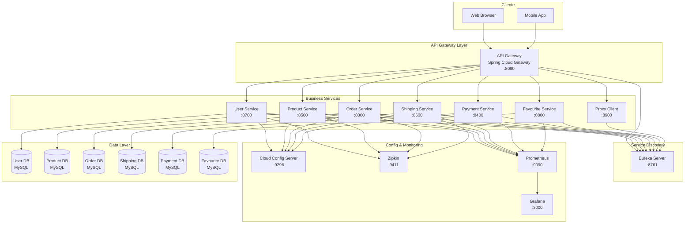
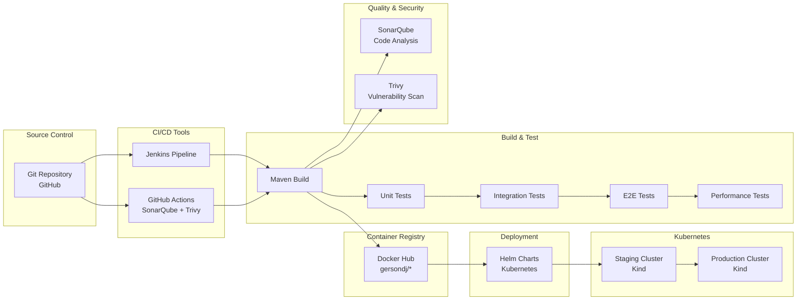
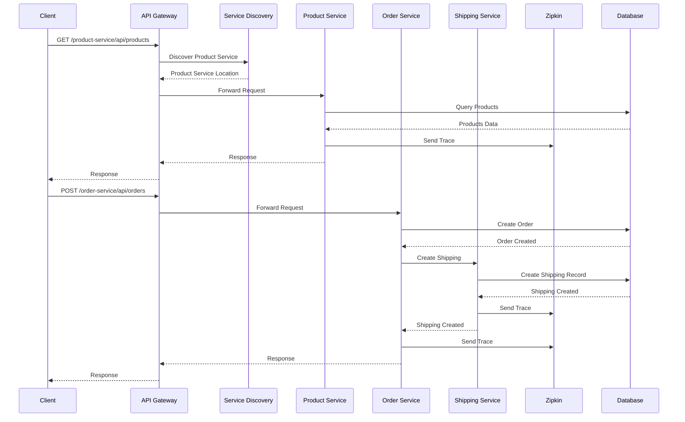
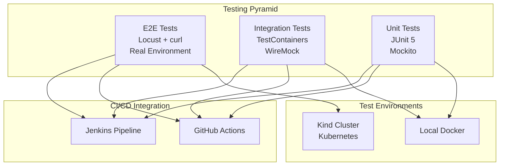
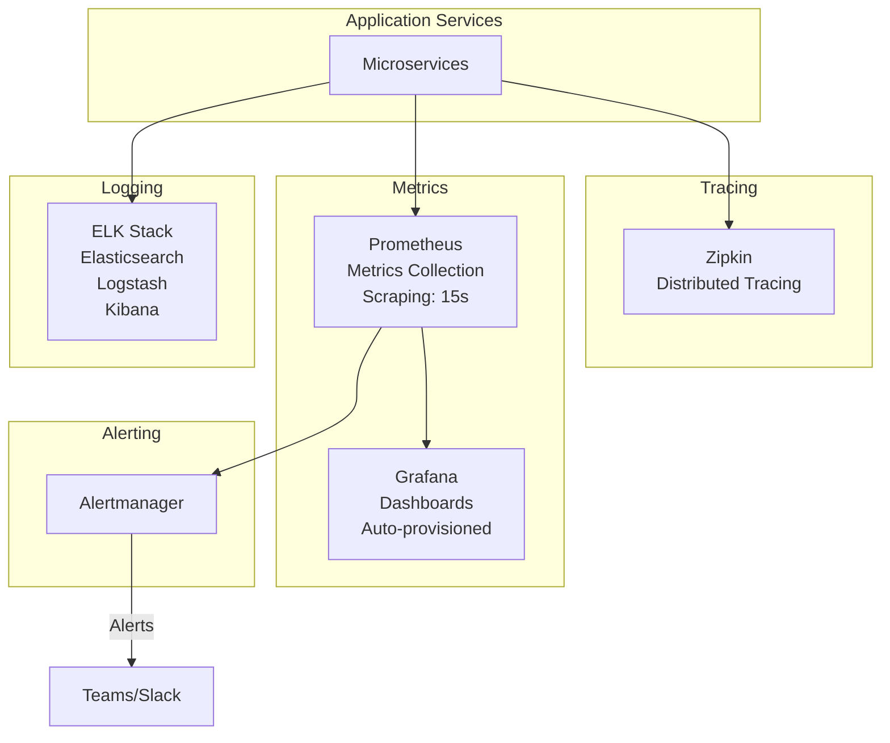
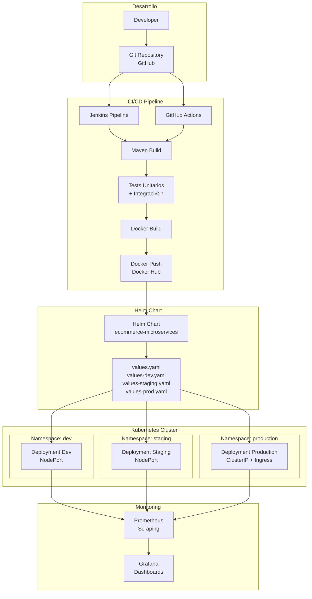
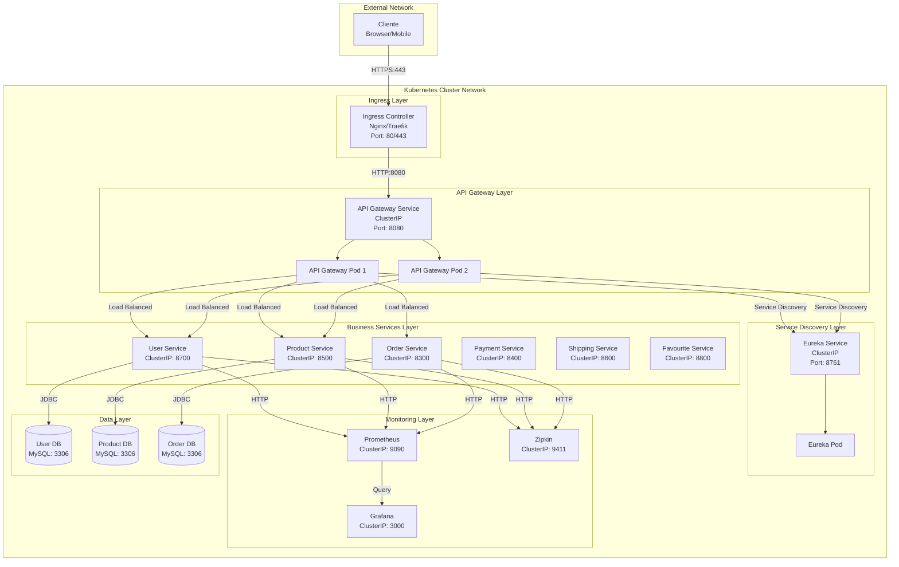
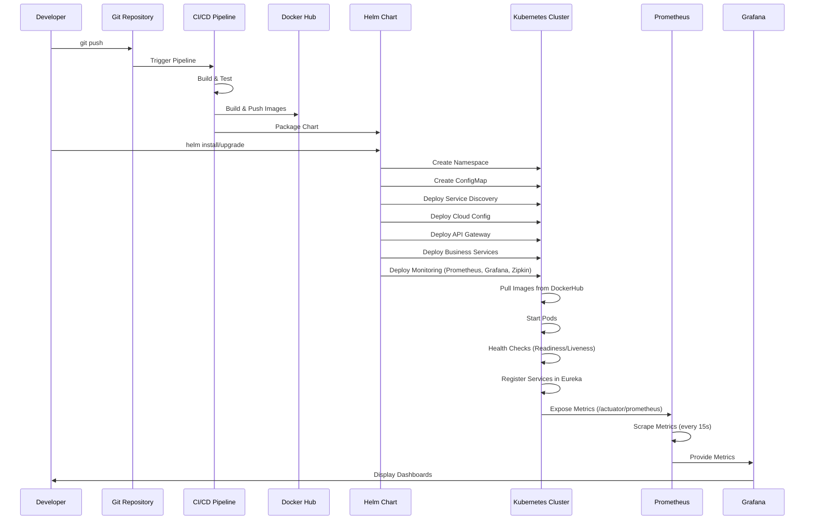

# 📋 Documentación Técnica del Proyecto E-Commerce Microservices

## üìë Tabla de Contenidos

1. [Introducción](#introducción)
2. [Arquitectura del Sistema](#arquitectura-del-sistema)
3. [Microservicios Implementados](#microservicios-implementados)
4. [Stack Tecnológico](#stack-tecnológico)
5. [Estrategia CI/CD](#estrategia-cicd)
6. [Análisis de Calidad de Código: SonarQube](#-análisis-de-calidad-de-código-sonarqube)
7. [Escaneo de Vulnerabilidades: Trivy](#-escaneo-de-vulnerabilidades-trivy)
8. [Despliegue con Helm](#-despliegue-con-helm)
9. [Estrategia de Testing](#estrategia-de-testing)
10. [Análisis de Métricas de Rendimiento](#análisis-de-métricas-de-rendimiento)
11. [Oportunidades de Mejora](#oportunidades-de-mejora)
12. [Diagramas de Arquitectura](#diagramas-de-arquitectura)

---

## 🎯 Introducción

### Descripción del Proyecto

Este proyecto es una **plataforma de e-commerce backend** construida bajo una arquitectura de **microservicios** utilizando **Spring Boot** y **Spring Cloud**. El sistema está diseñado para ser escalable, resiliente y mantenible, siguiendo las mejores prácticas de desarrollo de software empresarial.

### Objetivos del Proyecto

- **Escalabilidad Horizontal**: Cada microservicio puede escalarse independientemente seg√∫n la demanda
- **Alta Disponibilidad**: Sistema resiliente con circuit breakers y health checks
- **Despliegue Continuo**: Automatización completa de CI/CD con Jenkins y GitHub Actions
- **Observabilidad**: Monitoreo, tracing distribuido y métricas de rendimiento
- **Desacoplamiento**: Servicios independientes que se comunican mediante APIs REST

### Estado del Proyecto

‚úÖ **Implementado y Funcional**
- 11 microservicios core operativos
- Pipeline CI/CD completo (Jenkins + GitHub Actions)
- Tests unitarios, E2E y de rendimiento
- Despliegue automatizado en Kubernetes (Kind) con Helm
- Monitoreo completo con Prometheus, Grafana y Zipkin
- Análisis de código con SonarQube
- Escaneo de vulnerabilidades con Trivy
- Patrones de resiliencia (Circuit Breaker, Retry, Bulkhead)
- Feature Toggles para configuración dinámica

---

## 🏗️ Arquitectura del Sistema

### Patrón Arquitectónico

El proyecto implementa una **arquitectura de microservicios** con los siguientes componentes principales:

1. **Service Discovery (Eureka)**: Registro y descubrimiento de servicios
2. **API Gateway (Spring Cloud Gateway)**: Punto de entrada √∫nico para todas las peticiones
3. **Cloud Config Server**: Centralización de configuración
4. **Distributed Tracing (Zipkin)**: Trazabilidad de requests a través de servicios
5. **Circuit Breaker (Resilience4j)**: Resiliencia ante fallos

### Flujo de Comunicación

```
Cliente ‚Üí API Gateway ‚Üí Service Discovery ‚Üí Microservicios ‚Üí Bases de Datos
                ‚Üì
            Zipkin (Tracing)
                ‚Üì
         Prometheus (Métricas) → Grafana (Dashboards)
                ‚Üì
         SonarQube (Code Quality) + Trivy (Security)
```

### Principios de Diseño Aplicados

- **Single Responsibility**: Cada servicio tiene una responsabilidad específica
- **API-First**: Comunicación mediante APIs REST bien definidas
- **Stateless**: Los servicios no mantienen estado de sesión
- **Database per Service**: Cada servicio tiene su propia base de datos
- **Event-Driven**: Comunicación asíncrona cuando es necesario

### Patrones de Diseño Implementados

#### 1. **Patrón de Resiliencia (Circuit Breaker + Retry + Bulkhead)**
- **Implementación**: Resilience4j en todos los clientes HTTP entre microservicios
- **Servicios afectados**: `UserServiceClient`, `OrderServiceClient`, `ProductServiceClient` en todos los servicios
- **Características**:
  - **Circuit Breaker**: Protege contra fallos en cascada, abre el circuito cuando hay demasiados fallos
  - **Retry**: Reintentos autom√°ticos con backoff exponencial (3 intentos por defecto)
  - **Bulkhead**: Aislamiento de recursos, limita llamadas concurrentes (10 por defecto)
- **Configuración**: Por servicio en `application.yml` con thresholds personalizables
- **Ejemplo**: `order-service` protege sus llamadas al `user-service` con fallback autom√°tico

#### 2. **Patrón de Configuración / Feature Toggle**
- **Implementación**: `AppFeatureProperties` en cada servicio
- **Características**:
  - Habilitar/deshabilitar "enriquecimiento remoto" sin redeploy
  - Control de logs de resiliencia
  - Configuración centralizada vía Spring Cloud Config
- **Beneficios**: Cambios de comportamiento sin modificar código, A/B testing, rollback rápido

#### 3. **Patrón Adapter para Integración**
- **Implementación**: Clientes dedicados (`*ServiceClient`) en cada servicio
- **Características**:
  - Encapsulación de URLs y endpoints
  - Manejo centralizado de errores
  - Integración con patrones de resiliencia
  - Facilita testing y mockeo
- **Beneficios**: Desacoplamiento, fácil reemplazo de proveedores, código de negocio limpio

#### 4. **Patrón Service Discovery**
- **Implementación**: Eureka Server centralizado
- **Características**: Auto-registro, health checks, load balancing automático

#### 5. **Patrón API Gateway**
- **Implementación**: Spring Cloud Gateway
- **Características**: Punto de entrada único, enrutamiento dinámico, CORS, circuit breaker integration

---

## üîß Microservicios Implementados

### 1. **Service Discovery** (Puerto 8761)
- **Tecnología**: Spring Cloud Eureka Server
- **Función**: Registro centralizado de todos los microservicios
- **Características**:
  - Auto-registro de servicios
  - Health checks autom√°ticos
  - Dashboard de visualización
- **Razón de Implementación**: Permite que los servicios se descubran dinámicamente sin configuración hardcodeada

### 2. **Cloud Config Server** (Puerto 9296)
- **Tecnología**: Spring Cloud Config Server
- **Función**: Gestión centralizada de configuración
- **Características**:
  - Configuración por ambiente (dev, staging, prod)
  - Actualización dinámica sin reiniciar servicios
- **Razón de Implementación**: Centraliza la configuración, facilitando el mantenimiento y la gestión de múltiples ambientes

### 3. **API Gateway** (Puerto 8080)
- **Tecnología**: Spring Cloud Gateway
- **Función**: Punto de entrada único para todas las peticiones
- **Características**:
  - Enrutamiento din√°mico basado en rutas
  - Load balancing autom√°tico
  - CORS configurado
  - Circuit breaker integration
- **Razón de Implementación**: Simplifica el acceso del cliente, centraliza la seguridad y facilita el monitoreo

### 4. **User Service** (Puerto 8700)
- **Función**: Gestión de usuarios y autenticación
- **Endpoints principales**:
  - `POST /user-service/api/users` - Crear usuario
  - `GET /user-service/api/users/{id}` - Obtener usuario
  - `PUT /user-service/api/users/{id}` - Actualizar usuario
- **Razón de Implementación**: Separa la lógica de usuarios del resto del sistema, permitiendo escalabilidad independiente

### 5. **Product Service** (Puerto 8500)
- **Función**: Catálogo de productos
- **Endpoints principales**:
  - `GET /product-service/api/products` - Listar productos
  - `POST /product-service/api/products` - Crear producto
  - `GET /product-service/api/products/{id}` - Obtener producto
- **Razón de Implementación**: Servicio más consultado, requiere alta disponibilidad y escalabilidad

### 6. **Order Service** (Puerto 8300)
- **Función**: Gestión de órdenes
- **Endpoints principales**:
  - `POST /order-service/api/orders` - Crear orden
  - `GET /order-service/api/orders` - Listar órdenes
  - `GET /order-service/api/orders/{id}` - Obtener orden
- **Razón de Implementación**: Core del negocio, requiere transaccionalidad y consistencia

### 7. **Shipping Service** (Puerto 8600)
- **Función**: Gestión de envíos y tracking
- **Endpoints principales**:
  - `POST /shipping-service/api/shippings` - Crear envío
  - `GET /shipping-service/api/shippings` - Listar envíos
- **Razón de Implementación**: Servicio independiente que puede escalarse según demanda logística

### 8. **Payment Service** (Puerto 8400)
- **Función**: Procesamiento de pagos
- **Endpoints principales**:
  - `POST /payment-service/api/payments` - Procesar pago
  - `GET /payment-service/api/payments/{id}` - Obtener estado de pago
- **Razón de Implementación**: Servicio crítico que requiere seguridad y aislamiento

### 9. **Favourite Service** (Puerto 8800)
- **Función**: Gestión de favoritos del usuario
- **Endpoints principales**:
  - `POST /favourite-service/api/favourites` - Agregar favorito
  - `GET /favourite-service/api/favourites/{userId}` - Listar favoritos
- **Razón de Implementación**: Funcionalidad independiente que puede optimizarse por separado

### 10. **Proxy Client** (Puerto 8900)
- **Función**: Cliente frontend proxy
- **Características**: Interfaz para aplicación frontend
- **Razón de Implementación**: Facilita la comunicación entre el frontend y los microservicios

### 11. **Zipkin** (Puerto 9411)
- **Tecnología**: Distributed Tracing System
- **Función**: Trazabilidad distribuida de requests
- **Razón de Implementación**: Permite diagnosticar problemas de rendimiento y latencia en sistemas distribuidos

---

## 💻 Stack Tecnológico

### Backend
- **Java 11**: Lenguaje de programación
- **Spring Boot 2.5.7**: Framework principal
- **Spring Cloud 2020.0.4**: Microservicios y cloud-native features
- **Spring Data JPA**: Persistencia de datos
- **Resilience4j**: Circuit breaker y resiliencia
- **Spring Cloud Sleuth**: Distributed tracing
- **SpringDoc OpenAPI**: Documentación de APIs

### Infraestructura
- **Docker**: Containerización de todos los servicios
- **Kubernetes (Kind)**: Orquestación de contenedores para desarrollo y testing
- **Helm**: Gestión de despliegues en Kubernetes (charts reutilizables)
- **Maven**: Gestión de dependencias y build
- **Eureka**: Service discovery
- **Zipkin**: Distributed tracing
- **Prometheus**: Métricas y monitoreo (scraping de todos los servicios)
- **Grafana**: Dashboards y visualización de métricas

### CI/CD
- **Jenkins**: Pipeline de CI/CD principal
- **GitHub Actions**: CI/CD para workflows específicos
- **Docker Hub**: Registro de im√°genes
- **Kubectl**: Gestión de Kubernetes
- **Helm**: Despliegue automatizado en Kubernetes
- **SonarQube/SonarCloud**: Análisis de calidad de código
- **Trivy**: Escaneo de vulnerabilidades en im√°genes Docker

### Testing
- **JUnit 5**: Framework de testing
- **Mockito**: Mocking de dependencias
- **TestContainers**: Testing con contenedores reales
- **WireMock**: Mocking de servicios externos
- **Locust**: Testing de rendimiento

### Bases de Datos
- **MySQL/PostgreSQL**: Bases de datos relacionales por servicio
- **Flyway**: Migraciones de base de datos

---

## üöÄ Estrategia CI/CD

### Pipeline Dual: Jenkins + GitHub Actions

El proyecto implementa una estrategia híbrida de CI/CD para maximizar la flexibilidad y cobertura:

#### **Jenkins Pipeline** (Principal)

**Ubicación**: `Jenkinsfile`

**Características**:
- Pipeline completo de CI/CD
- Detección automática de cambios por servicio
- Build paralelo de servicios modificados
- Despliegue automático a staging/producción
- Tests E2E y de rendimiento

**Etapas del Pipeline**:
1. **Checkout & Detect Changes**: Identifica servicios modificados
2. **Build Core Services**: Construye service-discovery y api-gateway
3. **Build & Test Changed Services**: Compila y ejecuta tests unitarios
4. **Docker Build**: Construye im√°genes Docker
5. **Docker Push**: Sube im√°genes a Docker Hub
6. **Deploy Core Services**: Despliega servicios core a staging
7. **Deploy to Staging**: Despliega servicios modificados
8. **Integration Tests**: Ejecuta tests de integración
9. **Deploy Services for Testing**: Despliega todos los servicios
10. **E2E Tests**: Pruebas end-to-end
11. **Performance Tests**: Pruebas de rendimiento con Locust
12. **Deploy to Production**: Despliegue a producción (condicional)

**Variables de Entorno**:
- `REGISTRY`: `docker.io/gersondj`
- `K8S_NAMESPACE_STAGING`: `microservices-staging`
- `K8S_NAMESPACE_PROD`: `microservices-prod`

#### **GitHub Actions** (Complementario)

**Ubicación**: `.github/workflows/`

**Workflows Implementados**:

1. **Unit Tests Workflows** (30 archivos)
   - `*-pipeline-*-push.yml`: Ejecuta tests unitarios en push
   - `*-pipeline-*-pr.yml`: Ejecuta tests unitarios en pull requests
   - **Servicios**: api-gateway, cloud-config, user-service, product-service, order-service, shipping-service, payment-service, favourite-service, proxy-client, service-discovery
   - **Branches**: develop, stage, master

2. **E2E Tests Workflow** (`e2e-tests.yml`)
   - Crea cluster Kind temporal
   - Construye y despliega todos los servicios
   - Ejecuta pruebas end-to-end
   - Limpia recursos al finalizar

3. **Performance Tests Workflow** (`performance-tests.yml`)
   - Crea cluster Kind temporal
   - Despliega servicios
   - Ejecuta tests de rendimiento con Locust
   - Genera reportes HTML y CSV

**Ventajas de la Estrategia Dual**:
- ✅ **Jenkins**: Pipeline completo, control granular, integración con infraestructura propia
- ✅ **GitHub Actions**: Tests rápidos, feedback inmediato, integración nativa con GitHub
- ‚úÖ **Redundancia**: Si un sistema falla, el otro puede continuar

---

### 🔍 Análisis de Calidad de Código: SonarQube

**Ubicación**: `.github/workflows/sonarqube-analysis.yml`

**Características**:
- An√°lisis autom√°tico en push y pull requests a `main`/`master`
- Integración con SonarCloud (cloud-hosted)
- Quality Gate check autom√°tico
- Reportes de cobertura de código (JaCoCo)
- Detección de code smells, bugs y vulnerabilidades
- Integración con GitHub para comentarios en PRs

**Configuración**:
- **Secrets Requeridos**:
  - `SONAR_TOKEN`: Token de autenticación de SonarCloud
  - `SONAR_ORGANIZATION`: Organización en SonarCloud
  - `SONAR_PROJECT_KEY`: Clave del proyecto (opcional)
  - `SONAR_HOST_URL`: URL de SonarCloud (default: `https://sonarcloud.io`)

**Proceso**:
1. Build del proyecto con tests y cobertura (JaCoCo)
2. An√°lisis con SonarQube Maven plugin
3. Quality Gate check autom√°tico
4. Reportes disponibles en SonarCloud dashboard

**Métricas Analizadas**:
- Cobertura de código
- Duplicación de código
- Code smells
- Bugs y vulnerabilidades
- Deuda técnica
- Mantenibilidad

**Retry Logic**: Implementado para manejar errores transitorios de red (hasta 3 intentos)

---

### üîí Escaneo de Vulnerabilidades: Trivy

**Ubicación**: `.github/workflows/trivy-scan.yml`

**Características**:
- Escaneo autom√°tico de todas las im√°genes Docker
- Ejecución en paralelo para todos los microservicios (matrix strategy)
- Escaneo programado semanal (domingos a medianoche)
- Integración con GitHub Security tab
- Reportes en formato SARIF y tabla

**Servicios Escaneados**:
- user-service, product-service, order-service
- shipping-service, payment-service, favourite-service
- api-gateway, service-discovery, cloud-config, proxy-client

**Proceso**:
1. Build del proyecto Maven
2. Construcción de imagen Docker
3. Escaneo con Trivy (CRITICAL y HIGH severity)
4. Generación de reporte SARIF
5. Upload a GitHub Security tab
6. Reporte en formato tabla en logs

**Niveles de Severidad**:
- `CRITICAL`: Acción inmediata requerida
- `HIGH`: Debe abordarse pronto
- `MEDIUM`: Considerar abordar
- `LOW`: Baja prioridad

**Integración**:
- **GitHub Security**: Reportes SARIF visibles en Security tab
- **Jenkins**: Escaneo automático después de build de imágenes
- **Workflows de Servicios**: Trivy incluido en cada pipeline de servicio

---

### 📦 Despliegue con Helm

**Ubicación**: `helm/`

**Estructura**:
```
helm/
├── ecommerce-microservices/    # Chart principal (umbrella chart)
│   ├── Chart.yaml
│   ├── values.yaml              # Valores por defecto
│   ├── values-dev.yaml          # Desarrollo
│   ├── values-staging.yaml      # Staging
│   ├── values-prod.yaml         # Producción
│   └── templates/               # Templates Kubernetes
└── microservice/                # Chart genérico reutilizable
    ├── Chart.yaml
    ├── values.yaml
    └── templates/
```

**Características**:
- **Chart Umbrella**: Despliega todos los servicios en un solo comando
- **Chart Genérico**: Template reutilizable para microservicios
- **Multi-ambiente**: Configuraciones separadas para dev, staging y prod
- **Configuración Centralizada**: ConfigMap compartido para todos los servicios
- **Health Checks**: Readiness y liveness probes configurados
- **Recursos Configurables**: Requests y limits por servicio
- **Escalado**: Replicas configurables por servicio

**Servicios Incluidos**:
- Core: service-discovery, cloud-config, api-gateway
- Business: user-service, product-service, order-service, payment-service, shipping-service, favourite-service, proxy-client
- Monitoring: prometheus, grafana, zipkin

**Comandos Principales**:

```bash
# Instalación en desarrollo
helm install ecommerce-microservices ./helm/ecommerce-microservices \
  --namespace dev \
  --create-namespace \
  --values ./helm/ecommerce-microservices/values-dev.yaml \
  --set global.registry=your-registry \
  --set global.imageTag=latest

# Actualización
helm upgrade ecommerce-microservices ./helm/ecommerce-microservices \
  --namespace <namespace> \
  --values ./helm/ecommerce-microservices/values-<env>.yaml

# Desinstalación
helm uninstall ecommerce-microservices --namespace <namespace>
```

**Scripts de Automatización**:
- `helm/deploy.ps1`: Script PowerShell para despliegue completo
  - Setup de cluster Kind
  - Build de im√°genes
  - Carga a Kind
  - Despliegue con Helm
- `helm/install.ps1`: Script para instalación de Helm chart

**Configuración por Ambiente**:
- **Dev**: NodePort para acceso directo, recursos mínimos
- **Staging**: NodePort, recursos intermedios
- **Prod**: ClusterIP con Ingress recomendado, recursos optimizados

**Puertos Externos (NodePort)**:
- API Gateway: 30000
- Service Discovery: 30001
- Prometheus: 30090
- Grafana: 30300
- Zipkin: 30411

---

## üß™ Estrategia de Testing

### Pir√°mide de Testing

El proyecto implementa una **pir√°mide de testing completa** con m√∫ltiples niveles:

```
                    ┌─────────────────┐
                    │  E2E Tests      │  ← Pocos, críticos
                    └─────────────────┘
                ┌─────────────────────────┐
                │  Integration Tests     │  ← Algunos, importantes
                └─────────────────────────┘
        ┌───────────────────────────────────────┐
        │      Unit Tests                       │  ← Muchos, rápidos
        └───────────────────────────────────────┘
```

### 1. **Unit Tests** (Tests Unitarios)

**Framework**: JUnit 5 + Mockito + AssertJ

**Cobertura**:
- Tests por servicio en `src/test/java/`
- Validación de lógica de negocio
- Mocking de dependencias externas
- Validación de DTOs y entidades

**Ejecución**:
- **GitHub Actions**: Autom√°tico en cada push/PR
- **Jenkins**: Durante la etapa "Build & Test Changed Services"
- **Comando**: `mvn test`

**Configuración**:
```xml
<plugin>
    <groupId>org.apache.maven.plugins</groupId>
    <artifactId>maven-surefire-plugin</artifactId>
    <configuration>
        <includes>
            <include>**/*Test.java</include>
            <include>**/*Tests.java</include>
        </includes>
        <excludes>
            <exclude>**/*IntegrationTest.java</exclude>
        </excludes>
    </configuration>
</plugin>
```

**Ejemplo de Test**:
```java
@Test
@DisplayName("Should create user successfully")
void testCreateUser() {
    // Arrange
    UserDto userDto = new UserDto(...);
    
    // Act
    UserDto result = userService.create(userDto);
    
    // Assert
    assertThat(result).isNotNull();
    assertThat(result.getUserId()).isNotNull();
}
```

**Razón de Implementación**: Validar rápidamente la lógica de negocio antes de integraciones más complejas.

---

### 2. **Integration Tests** (Tests de Integración)

**Framework**: TestContainers + WireMock + Spring Boot Test

**Cobertura**:
- Comunicación entre servicios
- Integración con bases de datos reales
- Validación de APIs REST
- Simulación de servicios externos con WireMock

**Ejemplo**: `OrderPaymentServiceIntegrationTest`
- Prueba la comunicación entre Order Service y Payment Service
- Utiliza WireMock para simular respuestas del Payment Service
- Valida flujos transaccionales completos

**Ejecución**:
- **Jenkins**: Etapa "Integration Tests"
- **GitHub Actions**: Workflow `integration-tests.yml`

**Características**:
- Utiliza TestContainers para bases de datos reales
- Aislamiento mediante transacciones
- Validación de contratos entre servicios

**Razón de Implementación**: Asegurar que los servicios se comunican correctamente y que las integraciones funcionan como se espera.

---

### 3. **E2E Tests** (End-to-End Tests)

**Framework**: curl + bash scripts + validación de respuestas HTTP

**Cobertura**:
- Flujos completos de usuario
- Validación de escenarios de negocio end-to-end
- Pruebas en ambiente staging real

**Escenarios Testeados**:

1. **User Registration and Profile Update Flow**
   ```bash
   # Crear usuario
   POST /user-service/api/users
   # Validar respuesta
   # Actualizar usuario
   PUT /user-service/api/users/{id}
   ```

2. **Product Catalog and Order Creation Flow**
   ```bash
   # Listar productos
   GET /product-service/api/products
   # Crear orden
   POST /order-service/api/orders
   # Agregar items a orden
   POST /shipping-service/api/shippings
   ```

3. **Order Processing Flow**
   ```bash
   # Crear orden
   POST /order-service/api/orders
   # Procesar pago
   POST /payment-service/api/payments
   # Verificar estado
   GET /order-service/api/orders/{id}
   ```

**Ejecución**:
- **Jenkins**: Etapa "E2E Tests" después del despliegue a staging
- **GitHub Actions**: Workflow `e2e-tests.yml` con cluster Kind temporal

**Ambiente**:
- Cl√∫ster Kubernetes (Kind) con todos los servicios desplegados
- API Gateway expuesto vía port-forward o NodePort
- Validación de respuestas HTTP y códigos de estado

**Razón de Implementación**: Validar que todo el sistema funciona correctamente en conjunto, simulando el comportamiento real del usuario.

---

### 4. **Performance Tests** (Tests de Rendimiento)

**Framework**: Locust (Python)

**Configuración**:
- **Archivo**: `locustfile.py`
- **Usuarios simulados**: 50
- **Spawn rate**: 10 usuarios/segundo
- **Duración**: 300 segundos (5 minutos)
- **Host**: API Gateway (localhost:30080)

**Comportamiento Simulado**:

La clase `EcommerceUser` simula el comportamiento de un usuario real:

```python
class EcommerceUser(HttpUser):
    wait_time = between(1, 3)  # Espera entre 1-3 segundos
    
    @task(3)  # Peso 3 (27.3% probabilidad)
    def view_products(self):
        """Ver cat√°logo de productos"""
        
    @task(2)  # Peso 2 (18.2% probabilidad)
    def create_user(self):
        """Crear nuevo usuario"""
        
    @task(2)  # Peso 2 (18.2% probabilidad)
    def get_user(self):
        """Obtener detalles de usuario"""
        
    @task(1)  # Peso 1 (9.1% probabilidad cada uno)
    def create_order(self):
        """Crear orden"""
        
    @task(1)
    def add_order_item(self):
        """Agregar item a orden"""
        
    @task(1)
    def view_orders(self):
        """Ver órdenes"""
        
    @task(1)
    def view_order_items(self):
        """Ver items de orden"""
```

**Distribución de Tareas**:
- **viewProducts**: 27.3% (m√°s frecuente)
- **createUser**: 18.2%
- **getUser**: 18.2%
- **createOrder**: 9.1%
- **addOrderItem**: 9.1%
- **viewOrders**: 9.1%
- **viewOrderItems**: 9.1%

**Ejecución**:
- **Jenkins**: Etapa "Performance Tests"
- **GitHub Actions**: Workflow `performance-tests.yml`
- **Reportes**: HTML y CSV generados autom√°ticamente

**Razón de Implementación**: Identificar cuellos de botella, validar capacidad del sistema y asegurar que el rendimiento es aceptable bajo carga.

---

## 📊 Análisis de Métricas de Rendimiento

### Reporte de Locust - Ejecución del 3/11/2025

**Período**: 3/11/2025, 1:16:11 p.m. - 1:21:11 p.m. (5 minutos)
**Target Host**: http://localhost:30080
**Script**: locustfile.py

---

### üìà Resumen Ejecutivo

| Métrica | Valor | Interpretación |
|---------|-------|----------------|
| **Total Requests** | 7,202 | ‚úÖ Excelente volumen de pruebas |
| **Failed Requests** | 0 | ✅ **100% de éxito - Sin errores** |
| **Average Response Time** | 26.52 ms | ‚úÖ Excelente (objetivo < 100ms) |
| **RPS (Requests Per Second)** | 24.06 | ‚úÖ Buena tasa de procesamiento |
| **P95 Response Time** | 51 ms | ‚úÖ Muy bueno (objetivo < 200ms) |
| **P99 Response Time** | 330 ms | ⚠️ Aceptable (objetivo < 500ms) |
| **Max Response Time** | 6,189 ms | ⚠️ Requiere atención (picos ocasionales) |

**Veredicto General**: ‚úÖ **Sistema funcionando correctamente bajo carga**

---

### 📋 Estadísticas por Endpoint

#### 1. **GET /product-service/api/products**
- **Requests**: 2,019 (28% del total)
- **Fails**: 0
- **Average**: 28.74 ms
- **Min/Max**: 3 ms / 4,336 ms
- **P95**: 36 ms
- **P99**: 180 ms
- **RPS**: 6.74
- **Tamaño promedio**: 1,055 bytes

**An√°lisis**:
- ‚úÖ **Endpoint m√°s consultado** - Refleja el comportamiento real (cat√°logo de productos)
- ‚úÖ **Rendimiento excelente** en el 95% de los casos (36ms)
- ⚠️ **Picos ocasionales** hasta 4.3 segundos - Posible conexión a BD o cache miss
- ‚úÖ **Sin errores** - 100% de disponibilidad

**Recomendación**: Implementar cache (Redis) para reducir latencia y picos.

---

#### 2. **POST /user-service/api/users**
- **Requests**: 1,284 (18% del total)
- **Fails**: 0
- **Average**: 18.71 ms
- **Min/Max**: 4 ms / 3,294 ms
- **P95**: 39 ms
- **P99**: 150 ms
- **RPS**: 4.29
- **Tamaño promedio**: 473 bytes

**An√°lisis**:
- ‚úÖ **Rendimiento muy bueno** - Operaciones de escritura r√°pidas
- ‚úÖ **P95 excelente** (39ms) - El 95% de las respuestas son muy r√°pidas
- ⚠️ **Picos ocasionales** hasta 3.3 segundos - Posible validación de duplicados o escritura en BD
- ‚úÖ **Sin errores** - Sistema robusto

**Recomendación**: Optimizar consultas de validación (índices, cache de validaciones).

---

#### 3. **GET /user-service/api/users/4**
- **Requests**: 1,285 (18% del total)
- **Fails**: 0
- **Average**: 8.81 ms
- **Min/Max**: 3 ms / 469 ms
- **P95**: 20 ms
- **P99**: 59 ms
- **RPS**: 4.29
- **Tamaño promedio**: 510 bytes

**An√°lisis**:
- ‚úÖ **Rendimiento excepcional** - Lecturas muy r√°pidas
- ‚úÖ **P95 excelente** (20ms) - Consultas simples optimizadas
- ‚úÖ **Consistencia** - Menor variabilidad que otros endpoints
- ‚úÖ **Sin errores**

**Recomendación**: Mantener este nivel de rendimiento. Considerar cache para usuarios frecuentes.

---

#### 4. **GET /shipping-service/api/shippings**
- **Requests**: 695 (10% del total)
- **Fails**: 0
- **Average**: 97.44 ms ⚠️
- **Min/Max**: 17 ms / 6,189 ms
- **P95**: 340 ms
- **P99**: 1,300 ms
- **RPS**: 2.32
- **Tamaño promedio**: 2,040 bytes

**An√°lisis**:
- ⚠️ **Endpoint más lento** - Requiere optimización
- ⚠️ **Alta variabilidad** - P95 de 340ms y máximo de 6.2 segundos
- ⚠️ **Posible cuello de botella** - Consultas complejas o joins
- ‚úÖ **Sin errores** - Sistema funcional pero lento

**Recomendación**: 
- **URGENTE**: Revisar queries SQL, agregar índices
- Implementar paginación si no existe
- Considerar cache para consultas frecuentes
- Revisar relaciones con otras tablas (joins)

---

#### 5. **POST /order-service/api/orders**
- **Requests**: 636 (9% del total)
- **Fails**: 0
- **Average**: 11.34 ms
- **Min/Max**: 3 ms / 497 ms
- **P95**: 40 ms
- **P99**: 94 ms
- **RPS**: 2.12
- **Tamaño promedio**: 164 bytes

**An√°lisis**:
- ‚úÖ **Rendimiento excelente** - Operaciones de escritura r√°pidas
- ‚úÖ **P95 muy bueno** (40ms) - Transacciones eficientes
- ‚úÖ **Consistencia** - Baja variabilidad
- ‚úÖ **Sin errores**

**Recomendación**: Mantener este nivel. Considerar optimización de transacciones si se aumenta la complejidad.

---

#### 6. **GET /order-service/api/orders**
- **Requests**: 668 (9% del total)
- **Fails**: 0
- **Average**: 25.24 ms
- **Min/Max**: 4 ms / 3,529 ms
- **P95**: 32 ms
- **P99**: 360 ms
- **RPS**: 2.23
- **Tamaño promedio**: 798 bytes

**An√°lisis**:
- ‚úÖ **Rendimiento bueno** - Lecturas eficientes
- ‚úÖ **P95 excelente** (32ms) - Consultas optimizadas
- ⚠️ **Picos ocasionales** hasta 3.5 segundos - Posible crecimiento de datos
- ‚úÖ **Sin errores**

**Recomendación**: Implementar paginación si no existe. Monitorear crecimiento de datos.

---

#### 7. **POST /shipping-service/api/shippings**
- **Requests**: 615 (9% del total)
- **Fails**: 0
- **Average**: 9.53 ms
- **Min/Max**: 4 ms / 237 ms
- **P95**: 25 ms
- **P99**: 61 ms
- **RPS**: 2.05
- **Tamaño promedio**: 327 bytes

**An√°lisis**:
- ‚úÖ **Rendimiento excelente** - Operaciones de escritura muy r√°pidas
- ‚úÖ **P95 muy bueno** (25ms) - Inserciones eficientes
- ‚úÖ **Consistencia** - Baja variabilidad
- ‚úÖ **Sin errores**

**Recomendación**: Mantener este nivel de rendimiento.

---

### üìä An√°lisis de Percentiles (Response Time Statistics)

#### Percentiles Agregados (Todos los Endpoints)

| Percentil | Tiempo (ms) | Interpretación |
|-----------|-------------|----------------|
| **50% (Mediana)** | 6 ms | ‚úÖ Excelente - La mitad de las requests son instant√°neas |
| **60%** | 7 ms | ‚úÖ Muy bueno |
| **70%** | 8 ms | ‚úÖ Muy bueno |
| **80%** | 12 ms | ‚úÖ Excelente |
| **90%** | 29 ms | ‚úÖ Muy bueno |
| **95%** | 51 ms | ‚úÖ Excelente (objetivo < 200ms) |
| **99%** | 330 ms | ⚠️ Aceptable (objetivo < 500ms) |
| **100% (Máximo)** | 6,189 ms | ⚠️ Requiere atención (picos ocasionales) |

**Interpretación**:
- ‚úÖ **95% de las requests** se completan en menos de 51ms - Excelente
- ‚úÖ **99% de las requests** se completan en menos de 330ms - Aceptable
- ⚠️ **1% de las requests** pueden tardar hasta 6 segundos - Requiere investigación

**Conclusión**: El sistema es **muy rápido en la mayoría de los casos**, pero tiene **picos ocasionales** que deben investigarse.

---

### 🎯 Distribución de Carga

#### Ratio Per Class (Distribución de Tareas)

| Tarea | Porcentaje | Requests Estimados |
|-------|------------|-------------------|
| **viewProducts** | 27.3% | ~1,965 |
| **createUser** | 18.2% | ~1,310 |
| **getUser** | 18.2% | ~1,310 |
| **createOrder** | 9.1% | ~655 |
| **addOrderItem** | 9.1% | ~655 |
| **viewOrders** | 9.1% | ~655 |
| **viewOrderItems** | 9.1% | ~655 |

**An√°lisis**:
- ✅ **Distribución realista** - Los usuarios consultan productos más frecuentemente
- ‚úÖ **Balance adecuado** - Mezcla de lecturas y escrituras
- ‚úÖ **Escenario realista** - Refleja comportamiento de usuario real

---

### 🎯 Métricas Clave de Rendimiento

#### 1. **Throughput (RPS - Requests Per Second)**
- **Total RPS**: 24.06 requests/segundo
- **Interpretación**: El sistema puede procesar ~24 requests simultáneas por segundo
- **Capacidad**: Con 50 usuarios concurrentes, cada usuario hace ~0.48 requests/segundo (muy realista)

#### 2. **Tasa de Error**
- **Failed Requests**: 0 de 7,202
- **Tasa de Error**: 0%
- **Interpretación**: ✅ **Sistema 100% disponible** durante la prueba

#### 3. **Latencia Promedio**
- **Average**: 26.52 ms
- **Interpretación**: ✅ **Excelente** - Respuestas en menos de 30ms en promedio

#### 4. **Consistencia (P95/P99)**
- **P95**: 51 ms (excelente)
- **P99**: 330 ms (aceptable)
- **Interpretación**: El sistema es **consistente** en el 95% de los casos, con **variabilidad aceptable** en el 99%

---

### üîç An√°lisis de Picos de Latencia

#### Endpoints con Mayor Variabilidad

1. **GET /shipping-service/api/shippings**
   - M√°ximo: 6,189 ms
   - **Causa probable**: Consultas complejas, joins, falta de índices
   - **Impacto**: Alto (afecta experiencia de usuario)

2. **GET /product-service/api/products**
   - M√°ximo: 4,336 ms
   - **Causa probable**: Consultas sin cache, paginación ineficiente
   - **Impacto**: Medio (endpoint muy usado)

3. **GET /order-service/api/orders**
   - M√°ximo: 3,529 ms
   - **Causa probable**: Crecimiento de datos, falta de paginación
   - **Impacto**: Medio

**Recomendaciones**:
1. **Implementar cache** (Redis) para endpoints frecuentes
2. **Optimizar queries SQL** - Agregar índices, revisar joins
3. **Implementar paginación** si no existe
4. **Monitorear crecimiento de datos** - Considerar particionamiento

---

### ‚úÖ Conclusiones del An√°lisis

#### Fortalezas del Sistema

1. ‚úÖ **100% de disponibilidad** - Sin errores durante la prueba
2. ‚úÖ **Rendimiento excelente** en el 95% de los casos
3. ‚úÖ **Latencia promedio muy baja** (26.52 ms)
4. ‚úÖ **Throughput adecuado** (24 RPS)
5. ‚úÖ **Sistema estable** bajo carga de 50 usuarios concurrentes

#### Áreas de Mejora

1. ⚠️ **GET /shipping-service/api/shippings** - Requiere optimización urgente
2. ⚠️ **Picos ocasionales** - Investigar causas (BD, cache, red)
3. ⚠️ **P99 puede mejorarse** - Reducir de 330ms a <200ms

#### Métricas Objetivo

| Métrica | Actual | Objetivo | Estado |
|---------|--------|----------|--------|
| **Failed Requests** | 0% | < 0.1% | ‚úÖ Superado |
| **Average Response Time** | 26.52 ms | < 100 ms | ‚úÖ Superado |
| **P95 Response Time** | 51 ms | < 200 ms | ‚úÖ Superado |
| **P99 Response Time** | 330 ms | < 500 ms | ‚úÖ Cumplido |
| **Max Response Time** | 6,189 ms | < 1,000 ms | ‚ùå Requiere mejora |

---

## üöÄ Oportunidades de Mejora

### 1. **Performance y Escalabilidad** üî• ALTA PRIORIDAD

#### 1.1 Implementar Cache (Redis)
- **Problema**: Endpoints como `/product-service/api/products` tienen picos de latencia
- **Solución**: Implementar Redis para cache de productos, usuarios y órdenes frecuentes
- **Impacto**: Reducción de latencia del 50-80% en endpoints frecuentes
- **Esfuerzo**: Medio (2-3 semanas)

#### 1.2 Optimizar Queries SQL
- **Problema**: `GET /shipping-service/api/shippings` tiene latencia alta (P95: 340ms)
- **Solución**: 
  - Agregar índices en columnas frecuentemente consultadas
  - Optimizar joins complejos
  - Implementar paginación eficiente
- **Impacto**: Reducción de latencia del 60-70% en endpoints lentos
- **Esfuerzo**: Bajo-Medio (1-2 semanas)

#### 1.3 Implementar Connection Pooling
- **Problema**: Posible saturación de conexiones a BD
- **Solución**: Configurar HikariCP con pool optimizado
- **Impacto**: Mejora de throughput y estabilidad
- **Esfuerzo**: Bajo (3-5 días)

---

### 2. **Observabilidad y Monitoreo** ‚úÖ IMPLEMENTADO

#### 2.1 Dashboard de Métricas (Grafana) ✅
- **Estado**: ‚úÖ **Implementado y Funcional**
- **Implementación**: 
  - Prometheus scraping todos los servicios vía `/actuator/prometheus`
  - Grafana con datasource autom√°tico de Prometheus
  - Dashboard b√°sico pre-configurado
  - Provisioning autom√°tico de datasources y dashboards
- **Ubicación**: 
  - Docker Compose: `monitoring/grafana/`
  - Kubernetes: Incluido en Helm chart
- **Acceso**: 
  - Docker Compose: `http://localhost:3000` (admin/admin)
  - Kubernetes: NodePort 30300
- **Características**:
  - Scraping autom√°tico cada 15 segundos
  - Métricas de Spring Boot Actuator
  - Métricas de Resilience4j (circuit breakers, retries, bulkheads)
  - Métricas de JVM (memoria, CPU, threads)
  - Métricas HTTP (requests, latencia, errores)

#### 2.2 Alertas Automáticas ⚠️ PENDIENTE
- **Estado**: ⚠️ **Pendiente de Implementación**
- **Solución**: Configurar Alertmanager con Prometheus
- **Métricas clave a monitorear**:
  - Tasa de error > 1%
  - Latencia P95 > 200ms
  - Disponibilidad < 99.9%
  - Circuit breaker abierto
  - Uso de memoria > 80%
- **Impacto**: Detección temprana de problemas
- **Esfuerzo**: Bajo-Medio (1 semana)

#### 2.3 Logging Centralizado (ELK Stack)
- **Problema**: Logs distribuidos en m√∫ltiples servicios
- **Solución**: Implementar ELK (Elasticsearch, Logstash, Kibana)
- **Impacto**: B√∫squeda y an√°lisis de logs centralizado
- **Esfuerzo**: Medio (2 semanas)

---

### 3. **Seguridad** üî• ALTA PRIORIDAD

#### 3.1 Autenticación y Autorización (OAuth2/JWT)
- **Problema**: No hay autenticación implementada
- **Solución**: Implementar OAuth2 con JWT tokens
- **Impacto**: Seguridad de endpoints y datos
- **Esfuerzo**: Alto (3-4 semanas)

#### 3.2 Rate Limiting
- **Problema**: Vulnerable a ataques DDoS
- **Solución**: Implementar rate limiting en API Gateway
- **Impacto**: Protección contra abuso
- **Esfuerzo**: Bajo (3-5 días)

#### 3.3 HTTPS/TLS
- **Problema**: Comunicación sin cifrado
- **Solución**: Implementar certificados TLS
- **Impacto**: Seguridad de datos en tr√°nsito
- **Esfuerzo**: Medio (1 semana)

---

### 4. **Resiliencia y Alta Disponibilidad** ⚠️ MEDIA PRIORIDAD

#### 4.1 Implementar Retry Logic
- **Problema**: Fallos transitorios pueden causar errores
- **Solución**: Implementar retry con exponential backoff
- **Impacto**: Mayor resiliencia ante fallos temporales
- **Esfuerzo**: Bajo-Medio (1 semana)

**Nota**: Ya implementado con Resilience4j en los ServiceClients

#### 4.2 Health Checks Avanzados
- **Problema**: Health checks b√°sicos pueden no detectar problemas reales
- **Solución**: Implementar health checks que validen dependencias (BD, servicios externos)
- **Impacto**: Detección temprana de problemas
- **Esfuerzo**: Bajo (3-5 días)

#### 4.3 Auto-scaling Horizontal
- **Problema**: Escalado manual no es eficiente
- **Solución**: Implementar HPA (Horizontal Pod Autoscaler) en Kubernetes
- **Impacto**: Escalado autom√°tico seg√∫n carga
- **Esfuerzo**: Medio (1-2 semanas)

---

### 5. **Testing** ⚠️ MEDIA PRIORIDAD

#### 5.1 Aumentar Cobertura de Unit Tests
- **Problema**: Cobertura actual desconocida
- **Solución**: 
  - Aumentar cobertura a >80%
  - Implementar JaCoCo para métricas
- **Impacto**: Mayor confianza en cambios
- **Esfuerzo**: Alto (continuo)

#### 5.2 Tests de Carga Avanzados
- **Problema**: Tests de rendimiento b√°sicos
- **Solución**: 
  - Implementar escenarios m√°s complejos
  - Tests de estrés (spike testing)
  - Tests de resistencia (soak testing)
- **Impacto**: Mejor preparación para producción
- **Esfuerzo**: Medio (2 semanas)

#### 5.3 Contract Testing
- **Problema**: No hay validación de contratos entre servicios
- **Solución**: Implementar Spring Cloud Contract
- **Impacto**: Prevención de breaking changes
- **Esfuerzo**: Medio (2 semanas)

---

### 6. **CI/CD** ⚠️ MEDIA PRIORIDAD

#### 6.1 Implementar Canary Deployments
- **Problema**: Despliegues directos pueden causar problemas
- **Solución**: Implementar canary deployments en Kubernetes
- **Impacto**: Reducción de riesgo en despliegues
- **Esfuerzo**: Alto (3-4 semanas)

#### 6.2 Blue-Green Deployments
- **Problema**: Downtime durante despliegues
- **Solución**: Implementar blue-green deployments
- **Impacto**: Cero downtime en despliegues
- **Esfuerzo**: Alto (3-4 semanas)

#### 6.3 Automated Rollback
- **Problema**: Rollback manual es lento
- **Solución**: Implementar rollback automático basado en métricas
- **Impacto**: Recuperación rápida ante problemas
- **Esfuerzo**: Medio (2 semanas)

---

### 7. **Arquitectura** ⚠️ MEDIA PRIORIDAD

#### 7.1 Event-Driven Architecture
- **Problema**: Comunicación síncrona puede causar acoplamiento
- **Solución**: Implementar mensajería (RabbitMQ/Kafka) para eventos
- **Impacto**: Mayor desacoplamiento y escalabilidad
- **Esfuerzo**: Alto (4-6 semanas)

#### 7.2 API Versioning
- **Problema**: No hay versionado de APIs
- **Solución**: Implementar versionado en URLs o headers
- **Impacto**: Compatibilidad con versiones anteriores
- **Esfuerzo**: Medio (2 semanas)

#### 7.3 CQRS (Command Query Responsibility Segregation)
- **Problema**: Modelos de lectura y escritura mezclados
- **Solución**: Separar modelos de lectura y escritura
- **Impacto**: Optimización independiente de lecturas y escrituras
- **Esfuerzo**: Alto (6-8 semanas)

---

### 8. **Documentación** 📝 BAJA PRIORIDAD

#### 8.1 Documentación de APIs (OpenAPI/Swagger)
- **Problema**: Documentación básica
- **Solución**: Mejorar documentación OpenAPI con ejemplos
- **Impacto**: Facilita integración para desarrolladores
- **Esfuerzo**: Bajo (1 semana)

#### 8.2 Runbooks Operacionales
- **Problema**: No hay guías de operación
- **Solución**: Crear runbooks para operaciones comunes
- **Impacto**: Facilita troubleshooting
- **Esfuerzo**: Bajo (1 semana)

---

## üìê Diagramas de Arquitectura

> 📖 **Documentación Completa de Diagramas**: Para diagramas más detallados y específicos, consulta [docs/ARCHITECTURE_DIAGRAMS.md](docs/ARCHITECTURE_DIAGRAMS.md)

### 1. Arquitectura General del Sistema


```mermaid
graph TB
    subgraph "Cliente"
        Web[Web Browser]
        Mobile[Mobile App]
    end
    
    subgraph "API Gateway Layer"
        Gateway[API Gateway<br/>Spring Cloud Gateway<br/>:8080]
    end
    
    subgraph "Service Discovery"
        Eureka[Eureka Server<br/>:8761]
    end
    
    subgraph "Config & Monitoring"
        Config[Cloud Config Server<br/>:9296]
        Zipkin[Zipkin<br/>:9411]
        Prometheus[Prometheus<br/>:9090]
        Grafana[Grafana<br/>:3000]
    end
    
    subgraph "Business Services"
        User[User Service<br/>:8700]
        Product[Product Service<br/>:8500]
        Order[Order Service<br/>:8300]
        Shipping[Shipping Service<br/>:8600]
        Payment[Payment Service<br/>:8400]
        Favourite[Favourite Service<br/>:8800]
        Proxy[Proxy Client<br/>:8900]
    end
    
    subgraph "Data Layer"
        DB1[(User DB<br/>MySQL)]
        DB2[(Product DB<br/>MySQL)]
        DB3[(Order DB<br/>MySQL)]
        DB4[(Shipping DB<br/>MySQL)]
        DB5[(Payment DB<br/>MySQL)]
        DB6[(Favourite DB<br/>MySQL)]
    end
    
    Web --> Gateway
    Mobile --> Gateway
    Gateway --> Eureka
    Gateway --> User
    Gateway --> Product
    Gateway --> Order
    Gateway --> Shipping
    Gateway --> Payment
    Gateway --> Favourite
    Gateway --> Proxy
    
    User --> Eureka
    Product --> Eureka
    Order --> Eureka
    Shipping --> Eureka
    Payment --> Eureka
    Favourite --> Eureka
    Proxy --> Eureka
    
    User --> Config
    Product --> Config
    Order --> Config
    Shipping --> Config
    Payment --> Config
    
    User --> Zipkin
    Product --> Zipkin
    Order --> Zipkin
    Shipping --> Zipkin
    
    User --> DB1
    Product --> DB2
    Order --> DB3
    Shipping --> DB4
    Payment --> DB5
    Favourite --> DB6
    
    User --> Prometheus
    Product --> Prometheus
    Order --> Prometheus
    Shipping --> Prometheus
    Payment --> Prometheus
    Favourite --> Prometheus
    
    Prometheus --> Grafana
```

---

### 2. Flujo de CI/CD (Jenkins + GitHub Actions)


```mermaid
graph LR
    subgraph "Source Control"
        Git[Git Repository<br/>GitHub]
    end
    
    subgraph "CI/CD Tools"
        Jenkins[Jenkins Pipeline]
        GHA[GitHub Actions<br/>SonarQube + Trivy]
    end
    
    subgraph "Build & Test"
        Build[Maven Build]
        Unit[Unit Tests]
        Int[Integration Tests]
        E2E[E2E Tests]
        Perf[Performance Tests]
    end
    
    subgraph "Container Registry"
        DockerHub[Docker Hub<br/>gersondj/*]
    end
    
    subgraph "Quality & Security"
        SonarQube[SonarQube<br/>Code Analysis]
        Trivy[Trivy<br/>Vulnerability Scan]
    end
    
    subgraph "Deployment"
        Helm[Helm Charts<br/>Kubernetes]
    end
    
    subgraph "Kubernetes"
        Staging[Staging Cluster<br/>Kind]
        Prod[Production Cluster<br/>Kind]
    end
    
    Git --> Jenkins
    Git --> GHA
    
    Jenkins --> Build
    GHA --> Build
    
    Build --> Unit
    Unit --> Int
    Int --> E2E
    E2E --> Perf
    
    Build --> SonarQube
    Build --> Trivy
    Build --> DockerHub
    DockerHub --> Helm
    Helm --> Staging
    Staging --> Prod
```

---

### 3. Flujo de Request End-to-End


```mermaid
sequenceDiagram
    participant Client
    participant Gateway as API Gateway
    participant Eureka as Service Discovery
    participant Product as Product Service
    participant Order as Order Service
    participant Shipping as Shipping Service
    participant Zipkin as Zipkin
    participant DB as Database
    
    Client->>Gateway: GET /product-service/api/products
    Gateway->>Eureka: Discover Product Service
    Eureka-->>Gateway: Product Service Location
    Gateway->>Product: Forward Request
    Product->>DB: Query Products
    DB-->>Product: Products Data
    Product->>Zipkin: Send Trace
    Product-->>Gateway: Response
    Gateway-->>Client: Response
    
    Client->>Gateway: POST /order-service/api/orders
    Gateway->>Order: Forward Request
    Order->>DB: Create Order
    DB-->>Order: Order Created
    Order->>Shipping: Create Shipping
    Shipping->>DB: Create Shipping Record
    DB-->>Shipping: Shipping Created
    Shipping->>Zipkin: Send Trace
    Shipping-->>Order: Shipping Created
    Order->>Zipkin: Send Trace
    Order-->>Gateway: Response
    Gateway-->>Client: Response
```

---

### 4. Arquitectura de Testing


```mermaid
graph TB
    subgraph "Testing Pyramid"
        E2E[E2E Tests<br/>Locust + curl<br/>Real Environment]
        Int[Integration Tests<br/>TestContainers<br/>WireMock]
        Unit[Unit Tests<br/>JUnit 5<br/>Mockito]
    end
    
    subgraph "CI/CD Integration"
        Jenkins[Jenkins Pipeline]
        GHA[GitHub Actions]
    end
    
    subgraph "Test Environments"
        Kind[Kind Cluster<br/>Kubernetes]
        Local[Local Docker]
    end
    
    Unit --> Jenkins
    Unit --> GHA
    Int --> Jenkins
    Int --> GHA
    E2E --> Jenkins
    E2E --> GHA
    
    E2E --> Kind
    Int --> Local
    Unit --> Local
```

---

### 5. Arquitectura de Monitoreo y Observabilidad


```mermaid
graph TB
    subgraph "Application Services"
        Services[Microservices]
    end
    
    subgraph "Tracing"
        Zipkin[Zipkin<br/>Distributed Tracing]
    end
    
    subgraph "Metrics"
        Prometheus[Prometheus<br/>Metrics Collection<br/>Scraping: 15s]
        Grafana[Grafana<br/>Dashboards<br/>Auto-provisioned]
    end
    
    subgraph "Logging"
        ELK[ELK Stack<br/>Elasticsearch<br/>Logstash<br/>Kibana]
    end
    
    subgraph "Alerting"
        AlertManager[Alertmanager]
    end
    
    Services --> Zipkin
    Services --> Prometheus
    Services --> ELK
    
    Prometheus --> Grafana
    Prometheus --> AlertManager
    
    AlertManager --> |Alerts| Teams[Teams/Slack]
```

---

### 6. Arquitectura de Despliegue en Kubernetes

```mermaid
graph TB
    subgraph "External Access"
        Internet[Internet]
        Ingress[Ingress Controller<br/>Nginx/Traefik]
    end
    
    subgraph "Kubernetes Cluster"
        subgraph "Namespace: microservices"
            subgraph "Core Services"
                EurekaDeploy[Service Discovery<br/>Deployment<br/>Dev: 1, Staging: 1, Prod: 2<br/>NodePort: 30001]
                ConfigDeploy[Cloud Config<br/>Deployment<br/>Dev: 1, Prod: 2]
                GatewayDeploy[API Gateway<br/>Deployment<br/>Dev: 1, Staging: 2, Prod: 3<br/>NodePort: 30000]
            end
            
            subgraph "Business Services"
                UserDeploy[User Service<br/>Deployment<br/>Dev: 1, Staging: 2, Prod: 3]
                ProductDeploy[Product Service<br/>Deployment<br/>Dev: 1, Staging: 2, Prod: 3]
                OrderDeploy[Order Service<br/>Deployment<br/>Dev: 1, Staging: 2, Prod: 3]
                PaymentDeploy[Payment Service<br/>Deployment<br/>Dev: 1, Prod: 3]
                ShippingDeploy[Shipping Service<br/>Deployment<br/>Dev: 1, Prod: 2]
                FavouriteDeploy[Favourite Service<br/>Deployment<br/>Dev: 1, Prod: 2]
                ProxyDeploy[Proxy Client<br/>Deployment<br/>Dev: 1, Prod: 2]
            end
            
            subgraph "Monitoring Services"
                PrometheusDeploy[Prometheus<br/>Deployment<br/>Replicas: 1]
                GrafanaDeploy[Grafana<br/>Deployment<br/>Replicas: 1]
                ZipkinDeploy[Zipkin<br/>Deployment<br/>Replicas: 1]
            end
            
            subgraph "Services (ClusterIP/NodePort)"
                EurekaSvc[Service Discovery<br/>Service<br/>NodePort: 30001]
                GatewaySvc[API Gateway<br/>Service<br/>NodePort: 30000]
                PrometheusSvc[Prometheus<br/>Service<br/>NodePort: 30090]
                GrafanaSvc[Grafana<br/>Service<br/>NodePort: 30300]
                ZipkinSvc[Zipkin<br/>Service<br/>NodePort: 30411]
            end
            
            subgraph "ConfigMap"
                ConfigMap[Micro Config<br/>Shared ConfigMap]
            end
        end
        
        subgraph "Data Layer"
            subgraph "StatefulSets / External DBs"
                UserDB[(User DB<br/>MySQL<br/>StatefulSet)]
                ProductDB[(Product DB<br/>MySQL<br/>StatefulSet)]
                OrderDB[(Order DB<br/>MySQL<br/>StatefulSet)]
                PaymentDB[(Payment DB<br/>MySQL<br/>StatefulSet)]
                ShippingDB[(Shipping DB<br/>MySQL<br/>StatefulSet)]
                FavouriteDB[(Favourite DB<br/>MySQL<br/>StatefulSet)]
            end
        end
    end
    
    Internet --> Ingress
    Ingress --> GatewaySvc
    GatewaySvc --> GatewayDeploy
    
    GatewayDeploy --> EurekaSvc
    GatewayDeploy --> UserDeploy
    GatewayDeploy --> ProductDeploy
    GatewayDeploy --> OrderDeploy
    GatewayDeploy --> PaymentDeploy
    GatewayDeploy --> ShippingDeploy
    GatewayDeploy --> FavouriteDeploy
    GatewayDeploy --> ProxyDeploy
    
    UserDeploy --> EurekaSvc
    ProductDeploy --> EurekaSvc
    OrderDeploy --> EurekaSvc
    PaymentDeploy --> EurekaSvc
    ShippingDeploy --> EurekaSvc
    FavouriteDeploy --> EurekaSvc
    ProxyDeploy --> EurekaSvc
    
    UserDeploy --> ConfigDeploy
    ProductDeploy --> ConfigDeploy
    OrderDeploy --> ConfigDeploy
    PaymentDeploy --> ConfigDeploy
    ShippingDeploy --> ConfigDeploy
    FavouriteDeploy --> ConfigDeploy
    
    UserDeploy --> ConfigMap
    ProductDeploy --> ConfigMap
    OrderDeploy --> ConfigMap
    
    UserDeploy --> UserDB
    ProductDeploy --> ProductDB
    OrderDeploy --> OrderDB
    PaymentDeploy --> PaymentDB
    ShippingDeploy --> ShippingDB
    FavouriteDeploy --> FavouriteDB
    
    UserDeploy --> ZipkinSvc
    ProductDeploy --> ZipkinSvc
    OrderDeploy --> ZipkinSvc
    ShippingDeploy --> ZipkinSvc
    
    UserDeploy --> PrometheusSvc
    ProductDeploy --> PrometheusSvc
    OrderDeploy --> PrometheusSvc
    ShippingDeploy --> PrometheusSvc
    PaymentDeploy --> PrometheusSvc
    FavouriteDeploy --> PrometheusSvc
    
    PrometheusSvc --> GrafanaSvc
```

---

### 7. Flujo de Despliegue con Helm


```mermaid
graph TB
    subgraph "Desarrollo"
        Dev[Developer]
        Git[Git Repository<br/>GitHub]
    end
    
    subgraph "CI/CD Pipeline"
        Jenkins[Jenkins Pipeline]
        GHA[GitHub Actions]
        Build[Maven Build]
        Test[Tests Unitarios<br/>+ Integración]
        DockerBuild[Docker Build]
        DockerPush[Docker Push<br/>Docker Hub]
    end
    
    subgraph "Helm Chart"
        HelmChart[Helm Chart<br/>ecommerce-microservices]
        Values[values.yaml<br/>values-dev.yaml<br/>values-staging.yaml<br/>values-prod.yaml]
    end
    
    subgraph "Kubernetes Cluster"
        subgraph "Namespace: dev"
            DevDeploy[Deployment Dev<br/>NodePort]
        end
        
        subgraph "Namespace: staging"
            StagingDeploy[Deployment Staging<br/>NodePort]
        end
        
        subgraph "Namespace: production"
            ProdDeploy[Deployment Production<br/>ClusterIP + Ingress]
        end
    end
    
    subgraph "Monitoring"
        Prometheus[Prometheus<br/>Scraping]
        Grafana[Grafana<br/>Dashboards]
    end
    
    Dev --> Git
    Git --> Jenkins
    Git --> GHA
    
    Jenkins --> Build
    GHA --> Build
    
    Build --> Test
    Test --> DockerBuild
    DockerBuild --> DockerPush
    
    DockerPush --> HelmChart
    HelmChart --> Values
    
    Values --> DevDeploy
    Values --> StagingDeploy
    Values --> ProdDeploy
    
    DevDeploy --> Prometheus
    StagingDeploy --> Prometheus
    ProdDeploy --> Prometheus
    
    Prometheus --> Grafana
```

---

### 8. Arquitectura de Red y Comunicación


```mermaid
graph TB
    subgraph "External Network"
        Client[Cliente<br/>Browser/Mobile]
    end
    
    subgraph "Kubernetes Cluster Network"
        subgraph "Ingress Layer"
            Ingress[Ingress Controller<br/>Nginx/Traefik<br/>Port: 80/443]
        end
        
        subgraph "API Gateway Layer"
            GatewaySvc[API Gateway Service<br/>ClusterIP<br/>Port: 8080]
            GatewayPod1[API Gateway Pod 1]
            GatewayPod2[API Gateway Pod 2]
        end
        
        subgraph "Service Discovery Layer"
            EurekaSvc[Eureka Service<br/>ClusterIP<br/>Port: 8761]
            EurekaPod[Eureka Pod]
        end
        
        subgraph "Business Services Layer"
            UserSvc[User Service<br/>ClusterIP: 8700]
            ProductSvc[Product Service<br/>ClusterIP: 8500]
            OrderSvc[Order Service<br/>ClusterIP: 8300]
            PaymentSvc[Payment Service<br/>ClusterIP: 8400]
            ShippingSvc[Shipping Service<br/>ClusterIP: 8600]
            FavouriteSvc[Favourite Service<br/>ClusterIP: 8800]
        end
        
        subgraph "Monitoring Layer"
            PrometheusSvc[Prometheus<br/>ClusterIP: 9090]
            GrafanaSvc[Grafana<br/>ClusterIP: 3000]
            ZipkinSvc[Zipkin<br/>ClusterIP: 9411]
        end
        
        subgraph "Data Layer"
            UserDB[(User DB<br/>MySQL: 3306)]
            ProductDB[(Product DB<br/>MySQL: 3306)]
            OrderDB[(Order DB<br/>MySQL: 3306)]
        end
    end
    
    Client -->|HTTPS:443| Ingress
    Ingress -->|HTTP:8080| GatewaySvc
    GatewaySvc --> GatewayPod1
    GatewaySvc --> GatewayPod2
    
    GatewayPod1 -->|Service Discovery| EurekaSvc
    GatewayPod2 -->|Service Discovery| EurekaSvc
    EurekaSvc --> EurekaPod
    
    GatewayPod1 -->|Load Balanced| UserSvc
    GatewayPod1 -->|Load Balanced| ProductSvc
    GatewayPod1 -->|Load Balanced| OrderSvc
    GatewayPod2 -->|Load Balanced| UserSvc
    GatewayPod2 -->|Load Balanced| ProductSvc
    
    UserSvc -->|JDBC| UserDB
    ProductSvc -->|JDBC| ProductDB
    OrderSvc -->|JDBC| OrderDB
    
    UserSvc -->|HTTP| PrometheusSvc
    ProductSvc -->|HTTP| PrometheusSvc
    OrderSvc -->|HTTP| PrometheusSvc
    
    UserSvc -->|HTTP| ZipkinSvc
    ProductSvc -->|HTTP| ZipkinSvc
    OrderSvc -->|HTTP| ZipkinSvc
    
    PrometheusSvc -->|Query| GrafanaSvc
```

---

### 9. Arquitectura de Resiliencia (Circuit Breaker Pattern)

```mermaid
graph TB
    subgraph "Order Service"
        OrderController[Order Controller]
        OrderService[Order Service]
        UserClient[UserServiceClient<br/>@CircuitBreaker<br/>@Retry<br/>@Bulkhead]
    end
    
    subgraph "Resilience4j"
        CircuitBreaker[Circuit Breaker<br/>Failure Rate: 50%<br/>Min Calls: 5<br/>Wait Duration: 5s]
        Retry[Retry<br/>Max Attempts: 3<br/>Wait: 500ms]
        Bulkhead[Bulkhead<br/>Max Concurrent: 10<br/>Max Wait: 1s]
    end
    
    subgraph "User Service"
        UserController[User Controller]
        UserService[User Service]
    end
    
    subgraph "Fallback"
        FallbackMethod[fallbackUser Method<br/>Returns: N/A User]
    end
    
    OrderController --> OrderService
    OrderService --> UserClient
    
    UserClient --> CircuitBreaker
    CircuitBreaker --> Retry
    Retry --> Bulkhead
    
    Bulkhead -->|Success| UserController
    Bulkhead -->|Failure| FallbackMethod
    
    UserController --> UserService
    
    FallbackMethod -->|Returns| OrderService
    
    style CircuitBreaker fill:#ff9999
    style Retry fill:#99ccff
    style Bulkhead fill:#99ff99
    style FallbackMethod fill:#ffcc99
```

---

### 10. Flujo de Despliegue Detallado con Helm


```mermaid
sequenceDiagram
    participant Dev as Developer
    participant Git as Git Repository
    participant CI as CI/CD Pipeline
    participant DockerHub as Docker Hub
    participant Helm as Helm Chart
    participant K8s as Kubernetes Cluster
    participant Prom as Prometheus
    participant Graf as Grafana
    
    Dev->>Git: git push
    Git->>CI: Trigger Pipeline
    CI->>CI: Build & Test
    CI->>DockerHub: Build & Push Images
    CI->>Helm: Package Chart
    
    Dev->>Helm: helm install/upgrade
    Helm->>K8s: Create Namespace
    Helm->>K8s: Create ConfigMap
    Helm->>K8s: Deploy Service Discovery
    Helm->>K8s: Deploy Cloud Config
    Helm->>K8s: Deploy API Gateway
    Helm->>K8s: Deploy Business Services
    Helm->>K8s: Deploy Monitoring (Prometheus, Grafana, Zipkin)
    
    K8s->>K8s: Pull Images from DockerHub
    K8s->>K8s: Start Pods
    K8s->>K8s: Health Checks (Readiness/Liveness)
    K8s->>K8s: Register Services in Eureka
    
    K8s->>Prom: Expose Metrics (/actuator/prometheus)
    Prom->>Prom: Scrape Metrics (every 15s)
    Prom->>Graf: Provide Metrics
    Graf->>Dev: Display Dashboards
```

---

## üìù Resumen Ejecutivo

### Estado Actual

‚úÖ **Sistema Funcional y Estable**
- 11 microservicios operativos
- 100% de disponibilidad en tests de rendimiento
- Latencia promedio excelente (26.52 ms)
- Pipeline CI/CD completo y funcional
- **Despliegue con Helm**: Charts completos para Kubernetes
- **Monitoreo Completo**: Prometheus + Grafana implementados
- **Calidad de Código**: SonarQube integrado en CI/CD
- **Seguridad**: Trivy escaneando todas las im√°genes Docker
- **Patrones de Resiliencia**: Circuit Breaker, Retry y Bulkhead implementados
- **Feature Toggles**: Configuración dinámica sin redeploy

### Métricas Clave

| Métrica | Valor | Estado |
|---------|-------|--------|
| **Disponibilidad** | 100% | ‚úÖ Excelente |
| **Latencia Promedio** | 26.52 ms | ‚úÖ Excelente |
| **P95 Latency** | 51 ms | ‚úÖ Excelente |
| **P99 Latency** | 330 ms | ‚úÖ Aceptable |
| **Throughput** | 24.06 RPS | ‚úÖ Adecuado |
| **Tasa de Error** | 0% | ‚úÖ Perfecto |

### Próximos Pasos Recomendados

1. **Corto Plazo (1-2 meses)**
   - ✅ Dashboard de métricas (Grafana) - **COMPLETADO**
   - Implementar cache (Redis)
   - Optimizar queries SQL en Shipping Service
   - Implementar autenticación (OAuth2/JWT)
   - Configurar alertas en Prometheus/Alertmanager

2. **Medio Plazo (3-6 meses)**
   - Event-driven architecture
   - Canary deployments con Helm
   - Logging centralizado (ELK)
   - Aumentar cobertura de tests (>80%)
   - Mejorar dashboards de Grafana con métricas avanzadas

3. **Largo Plazo (6-12 meses)**
   - CQRS implementation
   - Auto-scaling avanzado (HPA con métricas de Prometheus)
   - Multi-region deployment
   - Advanced monitoring y alerting
   - Service Mesh (Istio/Linkerd)

---

## üìö Referencias

- **Spring Boot Documentation**: https://spring.io/projects/spring-boot
- **Spring Cloud Documentation**: https://spring.io/projects/spring-cloud
- **Kubernetes Documentation**: https://kubernetes.io/docs/
- **Locust Documentation**: https://docs.locust.io/
- **Jenkins Pipeline Documentation**: https://www.jenkins.io/doc/book/pipeline/

---

**Documento generado el**: 3 de noviembre de 2025
**Versión del Proyecto**: 0.1.0
**Última actualización**: Diciembre 2024
**Incluye**: Helm, SonarQube, Trivy, Prometheus, Grafana, Patrones de Resiliencia

---
**Nota**: Este documento refleja la arquitectura y configuración actualmente implementada en el proyecto.
