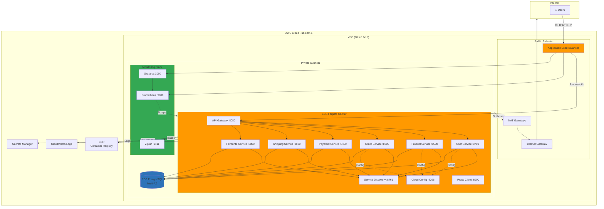
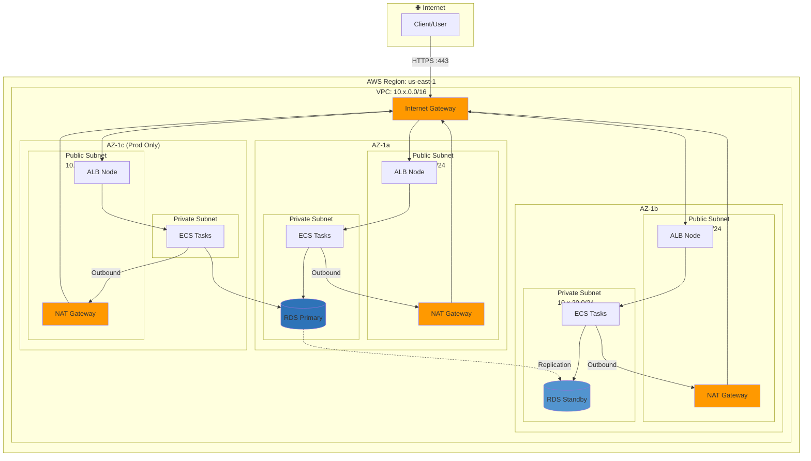
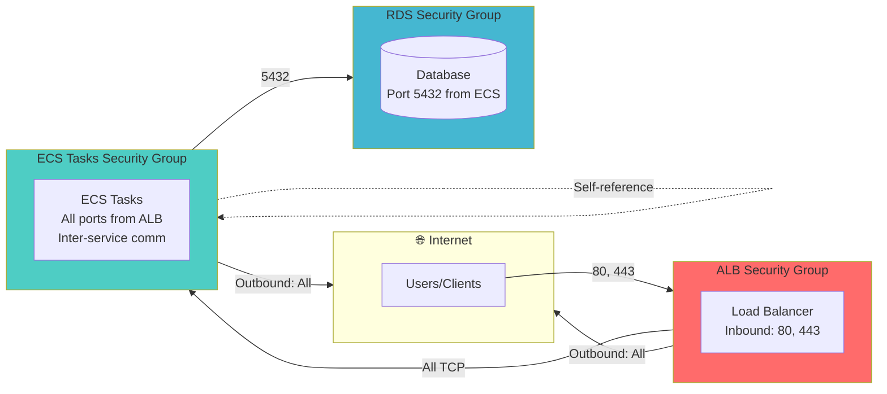
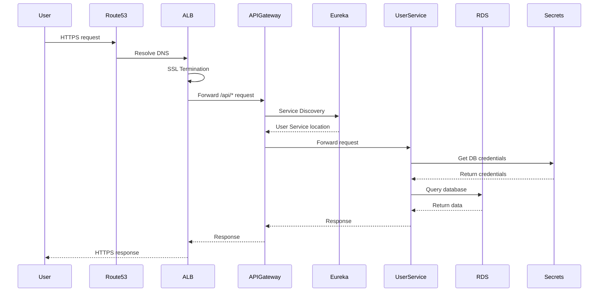
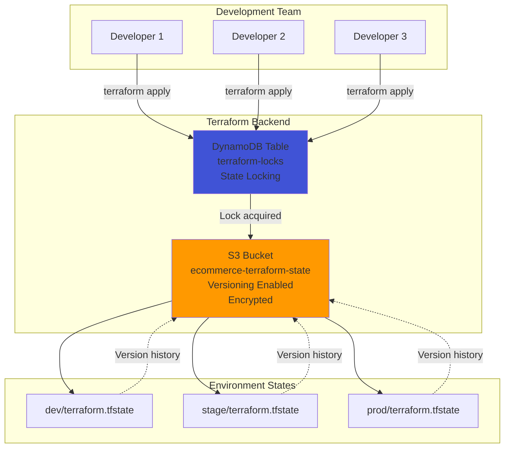
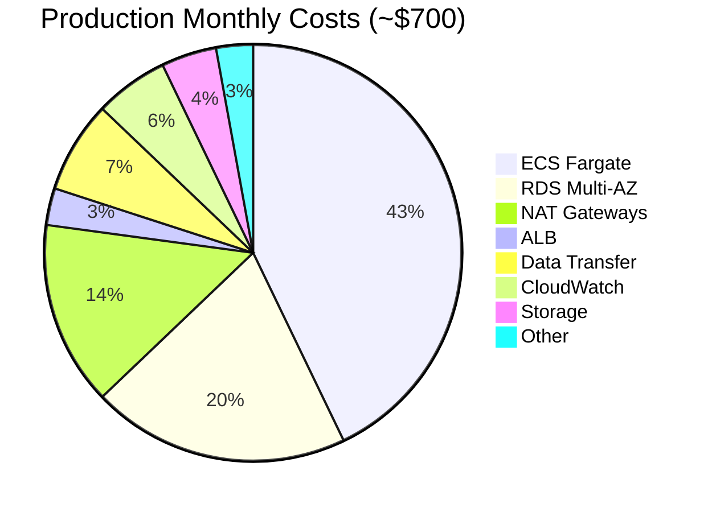
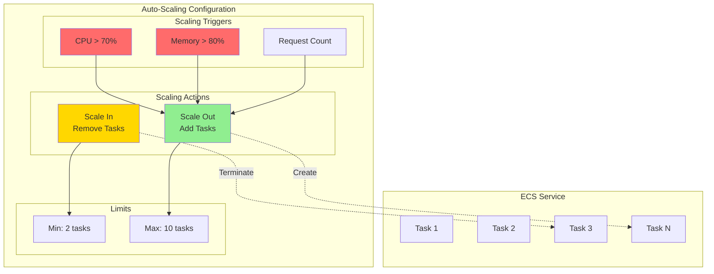
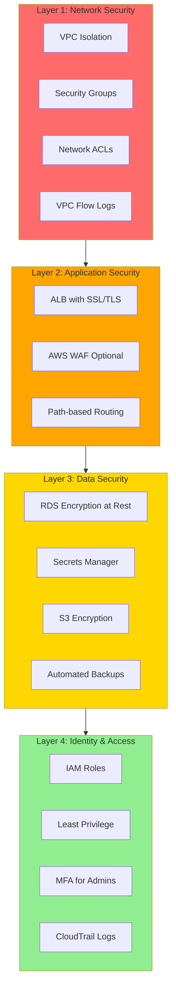

# Diagrama de Arquitectura AWS - E-Commerce Microservices

Este documento contiene diagramas de arquitectura en formato Mermaid que pueden visualizarse en GitHub o editores compatibles.

## 🏗️ Arquitectura General

## 🌐 Arquitectura de Red

## 🔐 Security Groups

## 🔄 Traffic Flow

## 📊 Deployment Pipeline

```mermaid
graph LR
    subgraph Developer["👨‍💻 Developer"]
        Code[Write Code]
    end
    
    subgraph Git["Git Repository"]
        Push[Git Push]
    end
    
    subgraph CI["CI/CD Pipeline"]
        Build[Build & Test]
        Docker[Build Docker Images]
        Push2ECR[Push to ECR]
        TFPlan[Terraform Plan]
    end
    
    subgraph Environments["AWS Environments"]
        Dev[Development<br/>Auto-deploy]
        Stage[Staging<br/>Auto-deploy + Tests]
        Prod[Production<br/>Manual approval]
    end
    
    Code --> Push
    Push --> Build
    Build --> Docker
    Docker --> Push2ECR
    Push2ECR --> TFPlan
    TFPlan --> Dev
    Dev --> Stage
    Stage -->|Approval| Prod

    style Dev fill:#90EE90
    style Stage fill:#FFD700
    style Prod fill:#FF6347
```

## 🗄️ Backend State Management

## 💰 Cost Distribution

## 📈 Scaling Architecture

## 🛡️ Security Layers

## 📝 Notas

- Todos los diagramas están en formato Mermaid
- Se pueden visualizar directamente en GitHub
- También funcionan en editores como VS Code con extensión Mermaid
- Para generar imágenes: usar [Mermaid Live Editor](https://mermaid.live/)

## 🔗 Referencias

- [Documentación completa](./AWS_INFRASTRUCTURE_GUIDE.md)
- [README principal](./README.md)
