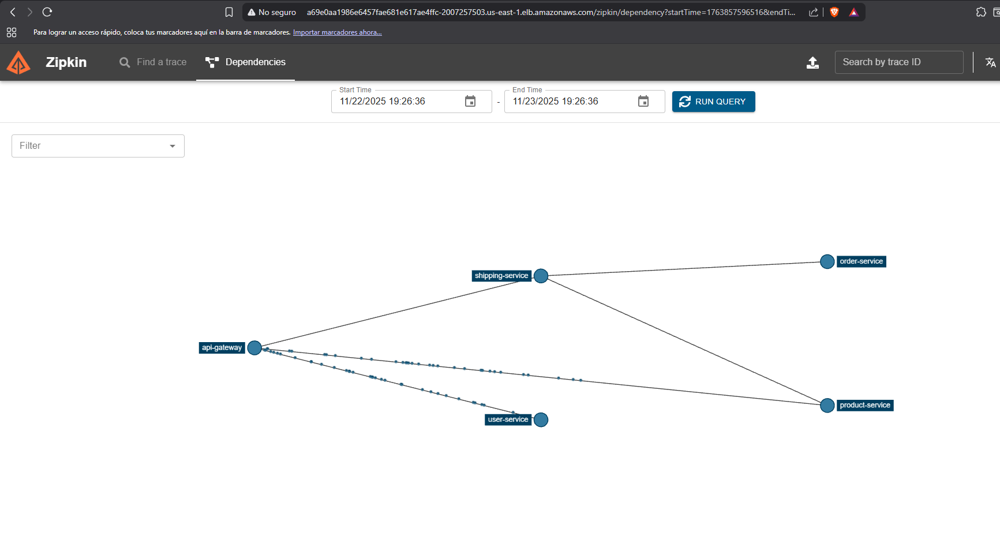

# Infraestructura - E-commerce Microservices

## 📁 Contenido

Este directorio contiene toda la infraestructura como código (IaC) para el proyecto e-commerce.

### Terraform (Azure)

La carpeta `terraform/` contiene la configuración completa de Terraform para desplegar la infraestructura en Microsoft Azure.

**Inicio rápido**: Ver [`terraform/QUICKSTART.md`](terraform/QUICKSTART.md)

**Documentos principales**:
- [`terraform/README.md`](terraform/README.md) - Guía completa de uso
- [`terraform/ENTREGA.md`](terraform/ENTREGA.md) - Documento de entrega del proyecto
- [`terraform/architecture.md`](terraform/architecture.md) - Arquitectura detallada
- [`terraform/COMMANDS.md`](terraform/COMMANDS.md) - Referencia de comandos

**Scripts de ayuda**:
- `terraform/deploy.ps1` - Despliegue automatizado
- `terraform/validate-names.ps1` - Validación de nombres únicos
- `terraform/backend-bootstrap.ps1` - Bootstrap con Azure CLI (legacy)

### Estructura

```
infra/
└── terraform/                    # Infraestructura como código
    ├── bootstrap/               # Backend remoto (ejecutar primero)
    ├── modules/                 # Módulos reutilizables
    │   ├── resource_group/
    │   ├── storage_account/
    │   ├── aks/
    │   └── acr/
    ├── environments/            # Configuraciones por ambiente
    │   ├── dev/
    │   ├── staging/
    │   └── prod/
    └── diagrams/                # Diagramas de arquitectura
```

### Recursos Creados

Por cada ambiente (dev/staging/prod):
- ✅ Resource Group
- ✅ Azure Kubernetes Service (AKS)
- ✅ Azure Container Registry (ACR)
- ✅ Storage Account (opcional)
- ✅ Managed Identity

Backend compartido:
- ✅ Storage Account para estado remoto de Terraform
- ✅ Container `tfstate` con keys por ambiente

### Despliegue Rápido

```powershell
cd terraform

# 1. Validar nombres
.\validate-names.ps1 -storageAccountName "miNombre" -acrName "miACR"

# 2. Bootstrap
cd bootstrap
cp terraform.tfvars.example terraform.tfvars
# Editar terraform.tfvars
terraform init && terraform apply

# 3. Ambiente
cd ..\environments\dev
cp terraform.tfvars.example terraform.tfvars
# Editar terraform.tfvars y backend.tfvars
terraform init -backend-config=backend.tfvars
terraform apply

# 4. Conectar
az aks get-credentials --resource-group ecom-dev-rg --name ecom-dev-aks
kubectl apply -f ..\..\..\..\k8s\base\
```

### Requisitos

- Azure CLI (`az`)
- Terraform (`>= 1.0`)
- Kubectl (para desplegar en AKS)
- Suscripción de Azure activa

### Soporte

Para problemas o dudas, consultar:
1. `terraform/QUICKSTART.md` - Inicio rápido
2. `terraform/COMMANDS.md` - Comandos comunes
3. `terraform/README.md` - Guía completa

---

**Estado**: ✅ Producción  
**Cloud**: Microsoft Azure  
**IaC**: Terraform  
**Última actualización**: Noviembre 2025


